# Relation argument (outer) token distance per label

In this document, we collect statistics regarding the token distance between the argumentative units in a relation on our six argument-mining datasets.

For the tokenization, we use `bert-base-uncased` from `transformer.AutoTokenizer` (see [AutoTokenizer](https://huggingface.co/docs/transformers/v4.37.1/en/model_doc/auto#transformers.AutoTokenizer), and [bert-based-uncased](https://huggingface.co/bert-base-uncased))
to tokenize `text` in `TextDocumentWithLabeledSpansAndBinaryRelations` (see [document type](https://github.com/ChristophAlt/pytorch-ie/blob/main/src/pytorch_ie/documents.py)).
The distance is measured from the first token of the first argumentative unit to the last token of the last unit, a.k.a. outer distance.

We collect the following statistics: number of documents in the split (*no. doc*), no. of relations (*len*), mean of token distance (*mean*), standard deviation of the distance (*std*), minimum outer distance (*min*), and maximum outer distance (*max*).
We also present histograms in the collasible, showing the distribution of these relation distances (x-axis; and unit-counts in y-axis), accordingly.

**Remark on statistics collection**:
To manually collect a statistics for each dataset, execute the command provided under each dataset,
using the base variant of the dataset configuration, namely, `*DATASET*_base`.
The script `evaluate_documents.py` comes from [PyTorch-IE-Hydra-Template](https://github.com/ArneBinder/pytorch-ie-hydra-template-1).

## AAE2

### train (322 documents)

|                   |  len | max |    mean | min |     std |
| :---------------- | ---: | --: | ------: | --: | ------: |
| ALL               | 9002 | 514 | 102.582 |   9 |   93.76 |
| attacks           |  810 | 442 | 127.622 |  10 | 109.283 |
| semantically_same |  552 | 514 | 301.638 |  25 |  73.756 |
| supports          | 7640 | 493 |  85.545 |   9 |  74.023 |

<details>
  <summary>Histogram (split: train, 322 documents)</summary>

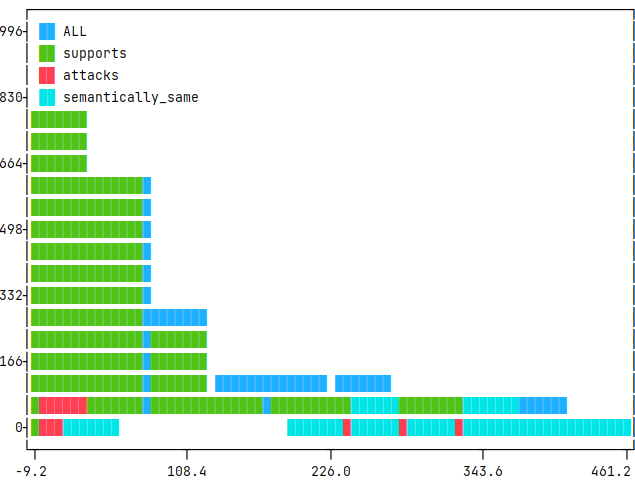

</details>

### test (80 documents)

|                   |  len | max |    mean | min |    std |
| :---------------- | ---: | --: | ------: | --: | -----: |
| ALL               | 2372 | 442 | 100.711 |  10 | 92.698 |
| attacks           |  184 | 402 | 115.891 |  12 | 98.751 |
| semantically_same |  146 | 442 | 299.671 |  34 | 72.921 |
| supports          | 2042 | 437 |  85.118 |  10 | 75.023 |

<details>
  <summary>Histogram (split: test, 80 documents)</summary>

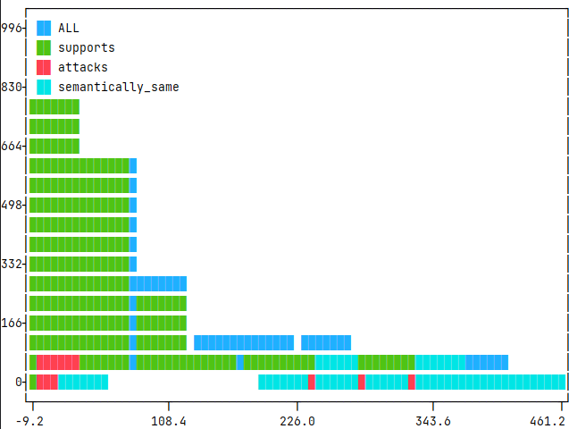

</details>

<details>
<summary>Command</summary>

```
python src/evaluate_documents.py dataset=aae2_base metric=count_relation_argument_distances
```

</details>

## AbsRCT

### neoplasm_train (350 documents)

|                |  len | max |    mean | min |    std |
| :------------- | ---: | --: | ------: | --: | -----: |
| ALL            | 2836 | 511 | 132.903 |  17 | 80.869 |
| Attack         |   72 | 346 |  89.639 |  29 | 75.554 |
| Partial-Attack |  338 | 324 |  59.024 |  17 | 42.773 |
| Support        | 2426 | 511 | 144.481 |  26 | 79.187 |

<details>
  <summary>Histogram (split: neoplasm_train, 350 documents)</summary>

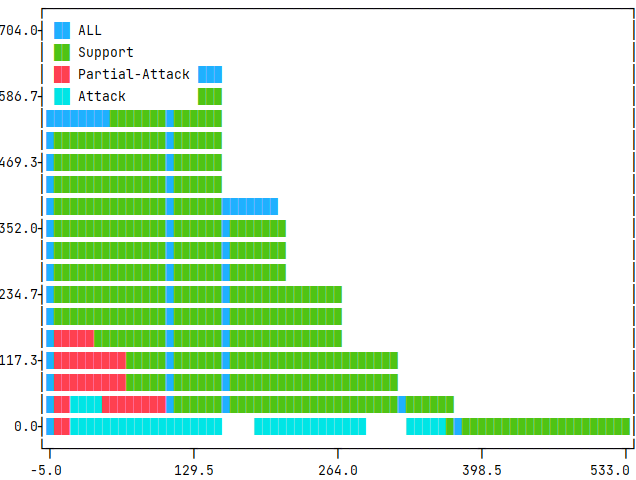

</details>

### neoplasm_dev (50 documents)

|                | len | max |    mean | min |    std |
| :------------- | --: | --: | ------: | --: | -----: |
| ALL            | 438 | 625 | 146.393 |  24 | 98.788 |
| Attack         |  16 | 200 |  90.375 |  26 | 62.628 |
| Partial-Attack |  50 | 240 |   72.04 |  24 | 47.685 |
| Support        | 372 | 625 | 158.796 |  34 | 99.922 |

<details>
  <summary>Histogram (split: neoplasm_dev, 50 documents)</summary>

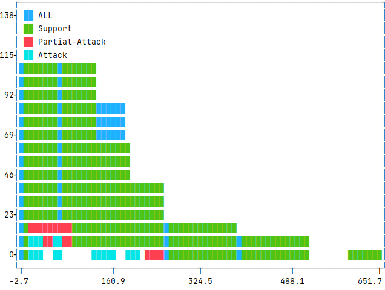

</details>

### neoplasm_test (100 documents)

|                | len | max |    mean | min |    std |
| :------------- | --: | --: | ------: | --: | -----: |
| ALL            | 848 | 459 | 126.731 |  22 | 75.363 |
| Attack         |  32 | 390 | 115.688 |  22 | 97.262 |
| Partial-Attack |  88 | 205 |  56.955 |  24 | 34.534 |
| Support        | 728 | 459 | 135.651 |  33 | 73.365 |

<details>
  <summary>Histogram (split: neoplasm_test, 100 documents)</summary>

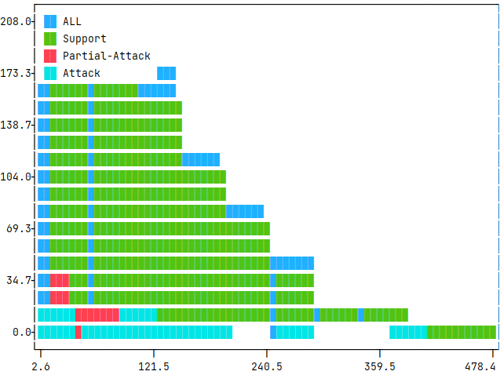

</details>

### glaucoma_test (100 documents)

|                | len | max |    mean | min |    std |
| :------------- | --: | --: | ------: | --: | -----: |
| ALL            | 734 | 488 | 159.166 |  26 | 83.885 |
| Attack         |  14 | 177 |      89 |  47 | 40.171 |
| Partial-Attack |  52 | 259 |      74 |  26 | 51.239 |
| Support        | 668 | 488 | 167.266 |  38 | 82.222 |

<details>
  <summary>Histogram (split: glaucoma_test, 100 documents)</summary>

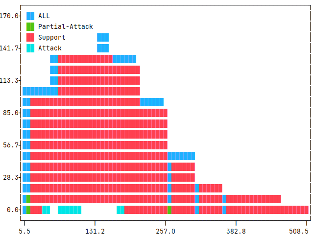

</details>

### mixed_test (100 documents)

|                | len | max |    mean | min |     std |
| :------------- | --: | --: | ------: | --: | ------: |
| ALL            | 658 | 459 | 145.067 |  23 |  77.921 |
| Attack         |   6 | 411 |     164 |  34 | 174.736 |
| Partial-Attack |  42 | 259 |  65.762 |  23 |  62.426 |
| Support        | 610 | 459 | 150.341 |  35 |  74.273 |

<details>
  <summary>Histogram (split: mixed_test, 100 documents)</summary>

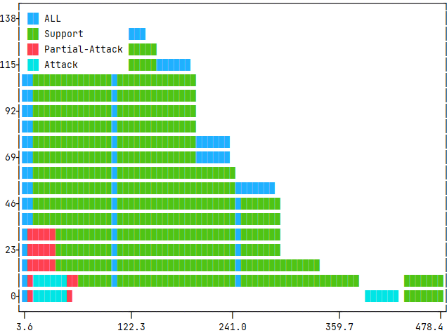

</details>

<details>
<summary>Command</summary>

```
python src/evaluate_documents.py dataset=abstrct_base metric=count_relation_argument_distances
```

</details>

## ArgMicro

|       |  len | max |   mean | min |    std |
| :---- | ---: | --: | -----: | --: | -----: |
| ALL   | 1018 | 127 | 44.434 |  14 | 21.501 |
| exa   |   18 |  63 | 33.556 |  16 | 13.056 |
| joint |   88 |  48 | 30.091 |  17 |  9.075 |
| reb   |  220 | 127 | 49.327 |  16 | 24.653 |
| sup   |  562 | 124 | 46.534 |  14 | 22.079 |
| und   |  130 |  84 | 38.292 |  17 | 12.321 |

<details>
  <summary>Histogram (split: train, 112 documents)</summary>

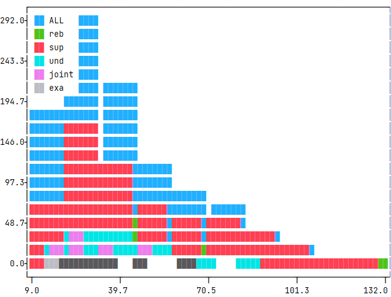

</details>

<details>
<summary>Command</summary>

```
python src/evaluate_documents.py dataset=argmicro_base metric=count_relation_argument_distances
```

</details>

## CDCP

### train (580 documents)

|          |  len | max |   mean | min |    std |
| :------- | ---: | --: | -----: | --: | -----: |
| ALL      | 2204 | 240 | 48.839 |   8 | 31.462 |
| evidence |   94 | 196 | 66.723 |  14 | 42.444 |
| reason   | 2110 | 240 | 48.043 |   8 |  30.64 |

<details>
  <summary>Histogram (split: train, 580 documents)</summary>

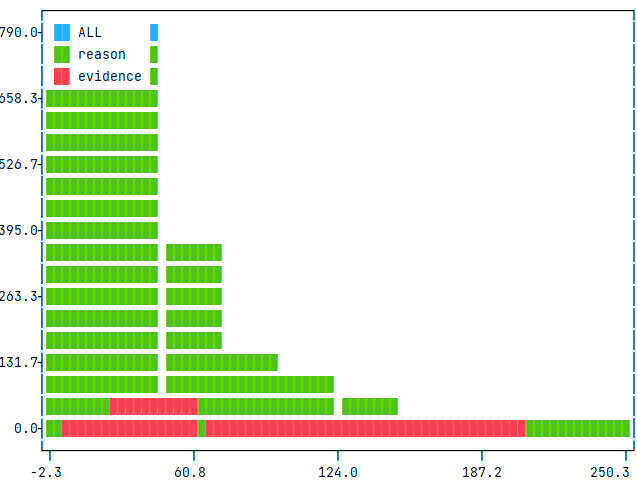

</details>

### test (150 documents)

|          | len | max |   mean | min |    std |
| :------- | --: | --: | -----: | --: | -----: |
| ALL      | 648 | 212 | 51.299 |   8 | 31.159 |
| evidence |  52 | 170 | 73.923 |  20 | 39.855 |
| reason   | 596 | 212 | 49.326 |   8 |  29.47 |

<details>
  <summary>Histogram (split: test, 150 documents)</summary>

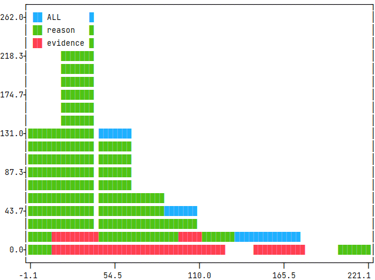

</details>

<details>
<summary>Command</summary>

```
python src/evaluate_documents.py dataset=cdcp_base metric=count_relation_argument_distances
```

</details>

## SciArg

|                   |   len |  max |    mean | min |     std |
| :---------------- | ----: | ---: | ------: | --: | ------: |
| ALL               | 15640 | 2864 |  30.524 |   3 |  45.351 |
| contradicts       |  1392 |  238 |  32.565 |   6 |  19.771 |
| parts_of_same     |  2594 |  374 |   28.18 |   3 |  26.845 |
| semantically_same |    84 | 2864 | 206.333 |  11 | 492.268 |
| supports          | 11570 |  407 |  29.527 |   4 |  24.189 |

<details>
  <summary>Histogram (split: train, 40 documents)</summary>

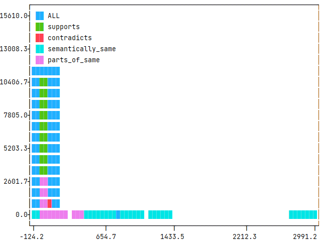

</details>

<details>
<summary>Command</summary>

```
python src/evaluate_documents.py dataset=sciarg_base metric=count_relation_argument_distances ++metric.tokenize_kwargs.strict_span_conversion=false
```

</details>

## SciDTB_Argmin

|            | len | max |   mean | min |    std |
| :--------- | --: | --: | -----: | --: | -----: |
| ALL        | 586 | 277 | 75.239 |  21 | 40.312 |
| additional |  54 | 180 | 59.593 |  36 | 29.306 |
| detail     | 258 | 163 |  65.62 |  22 |  29.21 |
| sequence   |  22 |  93 | 59.727 |  38 | 17.205 |
| support    | 252 | 277 | 89.794 |  21 | 48.118 |

<details>
  <summary>Histogram (split: train, 60 documents)</summary>

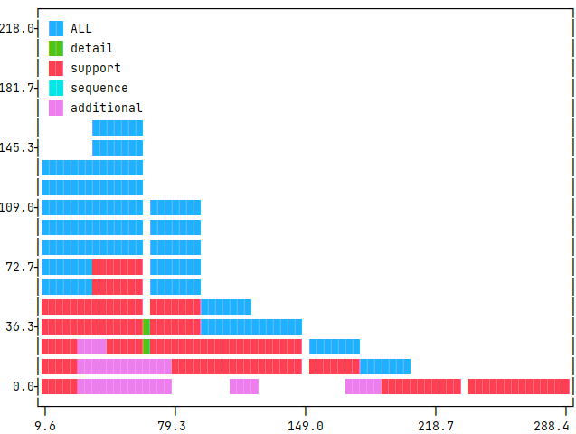

</details>

<details>
<summary>Command</summary>

```
python src/evaluate_documents.py dataset=scidtb_argmin_base metric=count_relation_argument_distances
```

</details>
