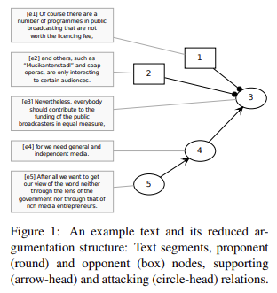

# Dataset Card for "argmicro"

### Dataset Summary

The arg-microtexts corpus features 112 short argumentative texts. All texts were originally written in German and have been professionally translated to English.
Based on Freeman’s theory of the macro-structure of arguments ([1991](https://api.pageplace.de/preview/DT0400.9783110875843_A19822678/preview-9783110875843_A19822678.pdf); [2011](https://link.springer.com/book/10.1007/978-94-007-0357-5)) and Toulmin ([2003](https://www.cambridge.org/core/books/uses-of-argument/26CF801BC12004587B66778297D5567C))'s diagramming techniques, ArgMicro consists of `pro` (proponent) and `opp` (opponent) components and six types of relations: `seg` (segment), `add` (addition), `exa` (example), `reb` (rebut), `sup` (support), and `und` (undercut). It also introduced segment-based spans, which also contain non-argumentative parts, in order to cover the whole text.

### Supported Tasks and Leaderboards

- **Tasks:** Structure Prediction, Relation Identification, Central Claim Identification, Role Classification, Function Classification
- **Leaderboards:** \[More Information Needed\]

### Languages

German, with English translation (by a professional translator).

## Dataset Structure

### Data Instances

- **Size of downloaded dataset files:** 2.89 MB

```
{
  "id": "micro_b001",
  "topic_id": "waste_separation",
  "stance": 1,
  "text": "Yes, it's annoying and cumbersome to separate your rubbish properly all the time. Three different bin bags stink away in the kitchen and have to be sorted into different wheelie bins. But still Germany produces way too much rubbish and too many resources are lost when what actually should be separated and recycled is burnt. We Berliners should take the chance and become pioneers in waste separation!",
  "edus": {
    "id": ["e1", "e2", "e3", "e4", "e5"],
    "start": [0, 82, 184, 232, 326],
    "end": [81, 183, 231, 325, 402]
  },
  "adus": {
    "id": ["a1", "a2", "a3", "a4", "a5"],
    "type": [0, 0, 1, 1, 1]
  },
  "edges": {
    "id": ["c1", "c10", "c2", "c3", "c4", "c6", "c7", "c8", "c9"],
    "src": ["a1", "e5", "a2", "a3", "a4", "e1", "e2", "e3", "e4"],
    "trg": ["a5", "a5", "a1", "c1", "c3", "a1", "a2", "a3", "a4"],
    "type": [4, 0, 1, 5, 3, 0, 0, 0, 0]
  }
}
```

### Data Fields

- `id`: the instance `id` of the document, a `string` feature
- `topic_id`: the topic of the document, a `string` feature (see [list of topics](https://huggingface.co/datasets/DFKI-SLT/argmicro/blob/main/topics_triggers.md))
- `stance`: the index of stance on the topic, an `int` feature (see [stance labels](https://huggingface.co/datasets/DFKI-SLT/argmicro/blob/main/argmicro.py#L35))
- `text`: the text content of the document, a `string` feature
- `edus`: elementary discourse units; a segmented span of text (see the authors' further [explanation](https://github.com/peldszus/arg-microtexts/blob/master/corpus/arggraph.dtd#L17-L20))
  - `id`: the instance `id` of EDUs, a list of `string` feature
  - `start`: the indices indicating the inclusive start of the spans, a list of `int` feature
  - `end`: the indices indicating the exclusive end of the spans, a list of `int` feature
- `adus`: argumentative discourse units; argumentatively relevant claims built on EDUs (see the authors' further [explanation](https://github.com/peldszus/arg-microtexts/blob/master/corpus/arggraph.dtd#L22-L28))
  - `id`: the instance `id` of ADUs, a list of `string` feature
  - `type`: the indices indicating the ADU type, a list of `int` feature (see [type list](https://huggingface.co/datasets/DFKI-SLT/argmicro/blob/main/argmicro.py#L36))
- `edges`: the relations between `adus` or `adus` and other `edges` (see the authors' further [explanation](https://github.com/peldszus/arg-microtexts/blob/master/corpus/arggraph.dtd#L39-L47))
  - `id`: the instance `id` of edges, a list of `string` feature
  - `src`: the `id` of `adus` indicating the source element in a relation, a list of `string` feature
  - `trg`: the `id` of `adus` or `edges` indicating the target element in a relation, a list of `string` feature
  - `type`: the indices indicating the edge type, a list of `int` feature (see [type list](https://huggingface.co/datasets/DFKI-SLT/argmicro/blob/main/argmicro.py#L37))

### Data Splits

|                                        | train |
| -------------------------------------- | ----: |
| No. of instances                       |   112 |
| No. of sentences/instance (on average) |   5.1 |

### Data Labels

#### Stance

| Stance      | Count | Percentage |
| ----------- | ----: | ---------: |
| `pro`       |    46 |     41.1 % |
| `con`       |    42 |     37.5 % |
| `unclear`   |     1 |      0.9 % |
| `UNDEFINED` |    23 |     20.5 % |

- `pro`: yes, in favour of the proposed issue
- `con`: no, against the proposed issue
- `unclear`: the position of the author is unclear
- `UNDEFINED`: no stance label assigned

See [stances types](https://github.com/peldszus/arg-microtexts/blob/master/corpus/arggraph.dtd#L74-L83).

#### ADUs

| ADUs  | Count | Percentage |
| ----- | ----: | ---------: |
| `pro` |   451 |     78.3 % |
| `opp` |   125 |     21.7 % |

- `pro`: proponent, who presents and defends his claims
- `opp`: opponent, who critically questions the proponent in a regimented fashion (Peldszus, 2015, p.5)

#### Relations

| Relations      | Count | Percentage |
| -------------- | ----: | ---------: |
| support: `sup` |   281 |     55.2 % |
| support: `exa` |     9 |      1.8 % |
| attack: `und`  |    65 |     12.8 % |
| attack: `reb`  |   110 |     21.6 % |
| other: `joint` |    44 |      8.6 % |

- `sup`: support (ADU->ADU)
- `exa`: support by example (ADU->ADU)
- `add`: additional source, for combined/convergent arguments with multiple premises, i.e., linked support, convergent support, serial support (ADU->ADU)
- `reb`: rebutting attack (ADU->ADU)
  - definition: "targeting another node and thereby challenging its acceptability"
- `und`: undercutting attack (ADU->Edge)
  - definition: "targeting an edge and thereby challenging the acceptability of the inference from the source to the target node"
    ([P&S, 2016](https://github.com/peldszus/arg-microtexts/blob/master/corpus/arggraph.dtd); [EN annotation guideline](https://www.ling.uni-potsdam.de/~stede/Papers/ArgGuidelinesEnglish.pdf))
- `joint`: combines text segments if one does not express a complete proposition on its own, or if the author divides a clause/sentence into parts, using punctuation

See other corpus statistics in Peldszus (2015), Section 5.

#### Example



(Peldszus & Stede, 2015, p. 940, Figure 1)

## Dataset Creation

This section is composed of information and excerpts provided in Peldszus ([2015](https://peldszus.github.io/files/eca2015-preprint.pdf)).

### Curation Rationale

"Argumentation can, for theoretical purposes, be studied on the basis of carefully constructed examples that illustrate specific phenomena...\[We\] address this need by making a resource publicly available that is designed to fill a particular gap." (pp. 2-3)

### Source Data

23 texts were written by the authors as a “proof of concept” for the idea. These texts also have been used as examples in teaching and testing argumentation analysis with students.

90 texts have been collected in a controlled text generation experiment, where normal competent language users wrote short texts of controlled linguistic and rhetoric complexity.

#### Initial Data Collection and Normalization

"Our contribution is a collection of 112 “microtexts” that have been written in response to trigger questions, mostly in the form of “Should one do X”. The texts are short but at the same time “complete” in that they provide a standpoint and a justification, by necessity in a fairly dense form." (p.2)

"The probands were asked to first gather a list with the pros and cons of the trigger question, then take stance for one side and argue for it on the basis of their reflection in a short argumentative text. Each text was to fulfill three requirements: It should be about five segments long; all segments should be argumentatively relevant, either formulating the main claim of the text, supporting the main claim or another segment, or attacking the main claim or another segment. Also, the probands were asked that at least one possible objection to the claim should be considered in the text. Finally, the text should be written in such a way that it would be understandable without having its trigger question as a headline." (p.3)

"\[A\]ll texts have been corrected for spelling and grammar errors...Their segmentation was corrected when necessary...some modifications in the remaining segments to maintain text coherence, which we made as minimal as possible." (p.4)

"We thus constrained the translation to preserve the segmentation of the text on the one hand (effectively ruling out phrasal translations of clause-type segments) and to preserve its linearization on the other hand (disallowing changes to the order of appearance of arguments)." (p.5)

#### Who are the source language producers?

The texts with ids b001-b064 and k001-k031 have been collected in a controlled text generation experiment from 23 subjects discussing various controversial issues from a fixed list. All probands were native speakers of
German, of varying age, education and profession.

The texts with ids d01-d23 have been written by Andreas Peldszus, the author.

### Annotations

#### Annotation process

All texts are annotated with argumentation structures, following the scheme proposed in Peldszus & Stede ([2013](https://www.ling.uni-potsdam.de/~peldszus/ijcini2013-preprint.pdf)). For inter-annotator-agreement scores see Peldszus (2014). The (German) annotation guidelines are published in Peldszus, Warzecha, Stede (2016). See the annotation guidelines ([de](https://www.ling.uni-potsdam.de/~stede/Papers/ArgGuidelinesGerman.pdf), [en](https://www.ling.uni-potsdam.de/~stede/Papers/ArgGuidelinesEnglish.pdf)), and the [annotation schemes](https://github.com/peldszus/arg-microtexts/blob/master/corpus/arggraph.dtd).

"\[T\]he markup of argumentation structures in the full corpus was done by one expert annotator. All annotations have been checked, controversial instances have been discussed in a reconciliation phase by two or more expert annotators...The annotation of the corpus was originally done manually on paper. In follow-up annotations, we used GraPAT ([Sonntag & Stede, 2014](http://www.lrec-conf.org/proceedings/lrec2014/pdf/824_Paper.pdf))." (p.7)

#### Who are the annotators?

\[More Information Needed\]

### Personal and Sensitive Information

\[More Information Needed\]

## Considerations for Using the Data

### Social Impact of Dataset

"Automatic argumentation recognition has many possible applications, including improving document summarization (Teufel and Moens, 2002), retrieval capabilities of legal databases (Palau and Moens, 2011), opinion mining for commercial purposes, or also as a tool for assessing public
opinion on political questions.

"...\[W\]e suggest there is yet one resource missing that could facilitate the development of automatic argumentation recognition systems: Short texts with explicit argumentation, little argumentatively irrelevant material, less rhetorical gimmicks (or even deception), in clean written language."
(Peldszus, [2014](https://aclanthology.org/W14-2112.pdf), p. 88)

### Discussion of Biases

\[More Information Needed\]

### Other Known Limitations

\[More Information Needed\]

## Additional Information

### Dataset Curators

\[More Information Needed\]

### Licensing Information

The arg-microtexts corpus is released under a Creative Commons Attribution-NonCommercial-ShareAlike 4.0 International License. (see [license agreement](https://creativecommons.org/licenses/by-nc-sa/4.0/))

### Citation Information

```
@inproceedings{peldszus2015annotated,
  title={An annotated corpus of argumentative microtexts},
  author={Peldszus, Andreas and Stede, Manfred},
  booktitle={Argumentation and Reasoned Action: Proceedings of the 1st European Conference on Argumentation, Lisbon},
  volume={2},
  pages={801--815},
  year={2015}
}
```

```
@inproceedings{peldszus2014towards,
  title={Towards segment-based recognition of argumentation structure in short texts},
  author={Peldszus, Andreas},
  booktitle={Proceedings of the First Workshop on Argumentation Mining},
  pages={88--97},
  year={2014}
}
```

### Contributions

Thanks to [@idalr](https://github.com/idalr) for adding this dataset.
