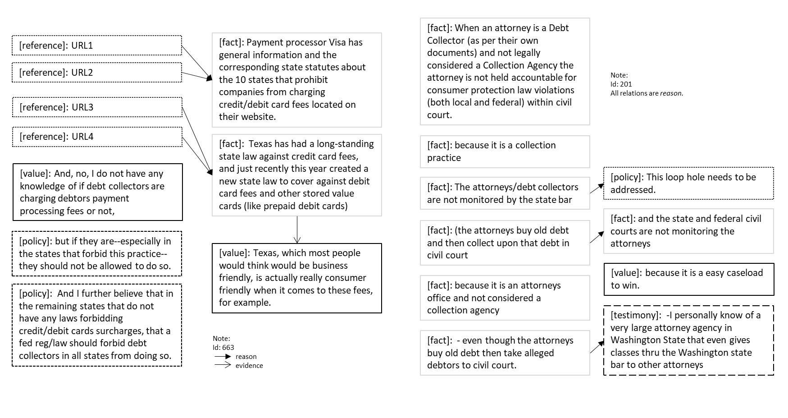

---
language:
  - en
size_categories:
  - n<1K
---

# Dataset Card for "cdcp"

### Dataset Summary

CDCP (a.k.a. *Cornell eRulemaking Corpus*; [Park and Cardie, 2018](https://aclanthology.org/L18-1257.pdf)) consists of 731 user comments from an eRulemaking platform in the English language. There are five types of components (`Fact`, `Testimony`, `Reference`, `Value`, and `Policy`) and two types of supporting relations (`Reason` and `Evidence`) are annotated on the basis of the study by Park et al. (2015). The resulting dataset contains 4931 elementary unit and 1221 support relation annotations. (pp. 1623-1624)

### Supported Tasks and Leaderboards

- **Tasks:** Argument Mining, Link Prediction, Component Classification, Relation Classification
- **Leaderboards:** https://paperswithcode.com/dataset/cdcp

### Languages

The language in the dataset is English (AmE).

## Dataset Structure

### Data Instances

- **Size of downloaded dataset files:** 5.37 MB

```
{
  'id': "00195",
  'text': "State and local court rules sometimes make default judgments much more likely. For example, when a person who allegedly owes a debt is told to come to court on a work day, they may be forced to choose between a default judgment and their job. I urge the CFPB to find practices that involve scheduling hearings at inconvenient times unfair, deceptive, and abusive, or inconsistent with 1692i",
  'proposition': {
        "start": [0, 78, 242],
        "end": [78, 242, 391],
        "label": [4, 4, 1],
        "url": ["", "", ""],
    },
  'relations': {"head": [0, 2], "tail": [1, 0], "label": [1, 1]},
}
```

### Data Fields

- `id`: the instance id of the text, a `string` feature
- `text`: the text (with URLs marked as `__URL__`), a `string` feature
- `proposition`: the annotation list of spans with labels and URL (if applicable), a `dictionary` feature
  - `start`: the indices indicating the inclusive start of the spans, a `list` of `int` feature
  - `end`: the indices indicating the exclusive end of the spans, a `list` of `int` feature
  - `label`: the indices indicating the span type, a `list` of `int` feature (see [label list](https://huggingface.co/datasets/DFKI-SLT/cdcp/blob/main/cdcp.py#L40))
  - `urls`: the URLs link with corresponding indices to each proposition, a `list` of `str` feature
- `relation`: the relation between labeled spans with relation labels, a `dictionary` feature
  - `head`: the indices indicating the first element in a relation, a `list` of `int` feature
  - `tail`: the indices indicating the second element in a relation, a `list` of `int` feature
  - `label`: the indices indicating the relation type in a relation, a `list` of `int` feature (see [label list](https://huggingface.co/datasets/DFKI-SLT/cdcp/blob/main/cdcp.py#L41))

### Data Splits

|                  | train | test |
| ---------------- | ----: | ---: |
| No. of instances |   581 |  150 |

### Label Description and Statistics

In this section, we report our own statistics of the corpus. However, note that there are yet discrepancies, comparing to the author's report (see Park & Cardie, 2017, p. 1627, Table 2), and in Morio et al. (2022), who also utilized this corpus.

#### Components

| Components                                                          |                               train |                              test |                                total |
| ------------------------------------------------------------------- | ----------------------------------: | --------------------------------: | -----------------------------------: |
| `Fact`<br/> `Testimony`<br/> `Reference`<br/> `Value`<br/> `Policy` | 654<br/>873<br/>31<br/>1686<br/>662 | 132<br/>244<br/>1<br/>496<br/>153 | 786<br/>1117<br/>32<br/>2182<br/>815 |

- `Value`: "judgments without making specific claims about what should be done"
- `Fact`: "expressing or dealing with facts or conditions as perceived without distortion by personal feelings, prejudices, or interpretations"
- `Testimony`:  "an objective proposition about the author’s personal state or experience"; "often practically impossible to provide objective evidence in online commenting setting"
- `Policy`: "a specific course of action to be taken"; "typically contains modal verbs like “should” and “ought to.”"
- `Reference`: "a source of objective evidence"

(Park & Cardie, 2018, p. 1625)

#### Relations

| Relations                |       train |       test |       total |
| :----------------------- | ----------: | ---------: | ----------: |
| `Reason`<br/> `Evidence` | 1055<br/>47 | 298<br/>26 | 1353<br/>73 |

- `Reason`: "X (source) is `reason` for a proposition Y (target; `policy`, `value`, `fact`, `testimony`) if X provides rationale for Y"
- `Evidence`: "X (`testimony`, `fact`, `reference`) is `evidence` for a proposition Y if X proves whether proposition Y is true or not"

(Park & Cardie, 2018, pp. 1625-1626)

#### Examples



## Dataset Creation

### Curation Rationale

"eRulemaking is a means for government agencies to directly reach citizens to solicit their opinions and experiences regarding newly proposed rules. The effort, however, is partly hampered by citizens’ comments that lack reasoning and evidence, which are largely ignored since government agencies are unable to evaluate the validity and strength." (p. 1623)

"It will be a valuable resource for building argument mining systems that can not only extract arguments from unstructured text, but also identify ways in which a given argument can be improved with respect to its evaluability." (p. 1624)

### Source Data

eRulemaking comments (see [eRulemaking](https://www.gsa.gov/about-us/organization/federal-acquisition-service/technology-transformation-services/erulemaking))

#### Initial Data Collection and Normalization

"Annotated 731 user comments on Consumer Debt Collection Practices (CDCP) rule by the Consumer Financial Protection Bureau (CFPB) posted on www.regulationroom.org." (p. 1624)

#### Who are the source language producers?

General public participants, implying American citizens.

"According to a voluntary user survey that asked the commenters to self-identify themselves, about 64% of the comments came from consumers, 22% from debt collectors, and the remainder from others, such as consumer advocates and counsellor organizations." (p. 1624)

### Annotations

#### Annotation process

"The annotators annotated the elementary units and support relations defined in the argumentation model proposed by [Park et al. (2015)](https://dl.acm.org/doi/10.1145/2746090.2746118)."

"Each user comment was annotated by two annotators, who independently determined the types of elementary units and support relations among them using the GATE annotation tool (Cunningham et al., 2011). A third annotator manually resolved the conflicts to produce the final dataset."

"Inter-annotator agreement between 2 annotators is measured with Krippendorf’s α with respect to elementary unit type (α=64.8%) and support relations (α=44.1%); IDs of supported elementary units are treated as labels for the supporting elementary units."

(p. 1626)

#### Who are the annotators?

\[More Information Needed\]

### Personal and Sensitive Information

\[More Information Needed\]

## Considerations for Using the Data

### Social Impact of Dataset

"Immediate applications include automatically ranking arguments based on their evaluability for a (crude) identification of read-worthy comments and providing real-time feedback to writers, specifying which types of support for which propositions can be added to construct better-formed arguments." (p. 1624)

### Discussion of Biases

About 45% of the elementary units are `VALUE` type. A significant portion, roughly 75%, of support relation annotations are between adjacent elementary units. While commenters certainly tend to provide reasons immediately after the proposition to be supported, it is also easier for annotators to identify support relations in proximity. Thus, support relations in the wild may be not as skewed toward those between adjacent elementary units. (pp. 1626-1627)

### Other Known Limitations

\[More Information Needed\]

## Additional Information

### Dataset Curators

\[More Information Needed\]

### Licensing Information

\[More Information Needed\]

### Citation Information

```
@inproceedings{park2018corpus,
  title={A corpus of erulemaking user comments for measuring evaluability of arguments},
  author={Park, Joonsuk and Cardie, Claire},
  booktitle={Proceedings of the Eleventh International Conference on Language Resources and Evaluation (LREC 2018)},
  year={2018}
}
```

### Contributions

Thanks to [@idalr](https://github.com/idalr) for adding this dataset.
