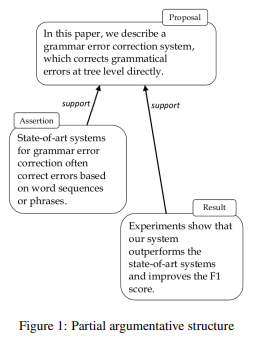
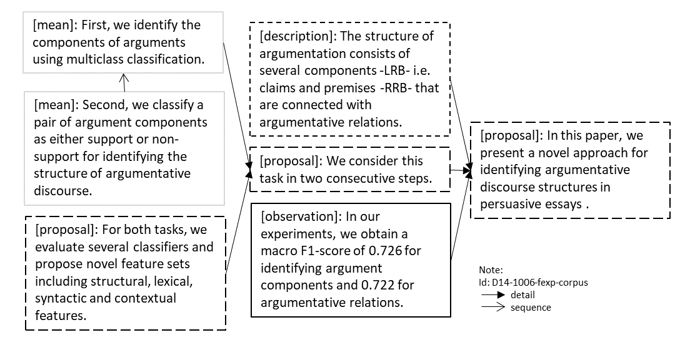

# Dataset Card for "SciDTB Argmin"

### Dataset Summary

Built from 60 English scientific abstracts in the larger annotated dataset: *Discourse Dependency TreeBank for Scientific Abstracts* (SciDTB; [Yang & Li, 2018](https://aclanthology.org/P18-2071)), [Accuosto and Saggion (2019)](https://aclanthology.org/W19-4505.pdf) offered a fine-grained annotated dataset for the argumentative component classification and relation classification tasks, based on the study of Kirschner et al. ([2015](https://aclanthology.org/W15-0501/)).
The dataset is token-based and segmented into elementary units that cover that entire text.

### Supported Tasks and Leaderboards

- **Tasks:** Argument Mining, Component Classification, Relation Classification
- **Leaderboards:** \[More Information Needed\]

### Languages

The language in the dataset is English (academic; computational linguistics).

## Dataset Structure

### Data Instances

- **Size of downloaded dataset files:** 32.4 KB ([link](http://scientmin.taln.upf.edu/argmin/scidtb_argmin_annotations.tgz))

```
{
  'id': 'D14-1002-fexp-corpus',
  'data': {
    'token': [ "This", "paper", "presents", "a", "deep", "semantic",...]
    'unit-bio': [ 0, 1, 1, 1, 1,...]
    'unit-label': [ 0, 0, 0, 0, 0,...]
    "role": [ 4, 4, 4, 4, 4,...]
    'parent-offset': [ 0, 0, 0, 0, 0,...]
    }
}
```

### Data Fields

- `id`: the instance `id` of the document, a `string` feature
- `data`: a `dictionary` feature, contains:
  - `token`: word tokens of the whole document, a `list` of `string` feature
  - `unit-bio`: the BIO label indicating whether the token at a particular index is the beginning of a unit (labeled as 0) or not (labeled as 1), a `list` of `int` feature
  - `unit-label`: the span label (which the token belongs to) indicating the argumentation type, a `list` of `int` feature (see [label list](https://huggingface.co/datasets/DFKI-SLT/scidtb_argmin/blob/main/scidtb_argmin.py#L42-50))
  - `role`: the relation label (of the span which the token belongs to) indicating the argumentation relation to another span, a `list` of `int` feature (see [label list](https://huggingface.co/datasets/DFKI-SLT/scidtb_argmin/blob/main/scidtb_argmin.py#L51))
  - `parent-offset`: the distance from the current span to the span it has a relation with (as indicated in `role`), a `list` of `int` feature

### Data Splits

This dataset contains 60 documents, and it is not pre-split.

### Label Description and Statistics

#### Components

|                                                                                        |                                 train |                                                  percentage |
| -------------------------------------------------------------------------------------- | ------------------------------------: | ----------------------------------------------------------: |
| `proposal`<br/>`mean`<br/>`result`<br/>`observation`<br/>`assertion`<br/>`description` | 110<br/>63<br/>74<br/>11<br/>88<br/>7 | 31.2 %<br/>17.8 %<br/>21.0 %<br/>3.1 %<br/>24.9 %<br/>2.0 % |

- `proposal`: problem or approach
- `assertion`: conclusion or known fact
- `result`: interpretation of data
- `observation`: data
- `means`: implementation
- `description`: definitions/other information

(Accuosto & Saggion, 2019, p. 44)

#### Relations

|                                                                     |                           train |                                    percentage |
| ------------------------------------------------------------------- | ------------------------------: | --------------------------------------------: |
| `support`<br/>`attack`<br/>`detail`<br/>`sequence`<br/>`additional` | 126<br/>0<br/>129<br/>11<br/>27 | 43.0 %<br/>0 %<br/>22.0 %<br/>3.8 %<br/>9.2 % |

- `support`: between an argument component A and another argument component B indicates that A supports (reasons, proves) B.
- `attack`: if A attacks (restricts, contradicts) B. However, the authors claimed that they did not identify any attack in the current texts (2020, p.44).
- `additional`: *not explicitly stated*, but possibly refers to discourse relation in Yang & Li (2018, p.445), in other words, elaboration
- `detail`: if A is a detail of B and gives more information or defines something stated in B without argumentative reason
- `sequence`: if two (or more) argument components belong together and only make sense in combination, i.e., they form a multi-sentence argument component.

(Kirschner et al., 2015, p. 5)

#### Examples


(Accuosto & Saggion, 2019, p.44, Figure 1)


## Dataset Creation

### Curation Rationale

"We propose to tackle the limitations posed by the lack of annotated data for argument mining in the scientific domain by leveraging existing Rhetorical Structure Theory (RST) (Mann et al., 1992) annotations in a corpus of computational linguistics abstracts (SciDTB) (Yang and Li, 2018)." (p. 42)

"We introduce a fine-grained annotation scheme aimed at capturing information that accounts for the specificities of the scientific discourse, including the type of evidence that is offered to support a statement (e.g., background information, experimental data or interpretation of results). This can provide relevant information, for instance, to assess the argumentative strength of a text." (p. 44)

### Source Data

The source data is a subset of EMNLP abstracts in the year 2014, available online at https://emnlp2014.org/.

#### Initial Data Collection and Normalization

"This work is informed by previous research in the areas of argument mining, argumentation quality assessment and the relationship between discourse and argumentative structures and, from the methodological perspective, to transfer learning approaches." Previously, Yang and Li (2018) divided a passage into non-overlapping text spans, which are named elementary discourse units (EDUs). They followed the criterion of Polanyi (1988) and Irmer (2011) and the guidelines defined by (Carlson and Marcu, 2001). For more information about the initial data collection and annotation, please see the SciDTB's [dataset card](https://huggingface.co/datasets/DFKI-SLT/scidtb).

The current authors added a new annotation layer for to the elementary discourse units (EDUs) annotated by Yang & Li (2018), namely, fine-grained argumentative labels and relation labels from the RST Framework. (p. 43)

#### Who are the source language producers?

No demography or identity information of the source language producer is reported by the authors, but we infer that the dataset was human-generated, specifically the academics in the field of computational linguistics/NLP, and possibly edited by human reviewers.

### Annotations

#### Annotation process

"We consider a subset of the SciDTB corpus consisting of 60 abstracts from the Proceedings of the 2014 Conference on Empirical Methods in Natural Language Processing (EMNLP) and transformed them into a format suitable for the GraPAT graph annotation tool (Sonntag and Stede, 2014).

"...The corpus enriched with the argumentation level contains a total of 327 sentences, 8012 tokens, 862 discourse units and 352 argumentative units linked by 292 argumentative relations."
(p. 43)

#### Who are the annotators?

\[More Information Needed\]

### Personal and Sensitive Information

\[More Information Needed\]

## Considerations for Using the Data

### Social Impact of Dataset

"The development of automatic systems to support the quality assessment of scientific texts can facilitate the work of editors and referees of scientific publications and, at the same time, be of value for researchers to obtain feedback that can lead to improve the communication of their results...Aspects such as the argumentative structure of the text are key when analyzing its effectiveness with respect to its communication objectives (Walton and Walton, 1989)." (p. 41)

"Being able to extract not only what is being stated by the authors of a text but also the reasons they provide to support it can be useful in multiple applications, ranging from a finegrained analysis of opinions to the generation of abstractive summaries of texts." (p. 41)

### Discussion of Biases

"The types of argumentative units are distributed as follows: 31% of the units are of type proposal, 25% assertion, 21% result, 18% means, 3% observation, and 2% description. In turn, the relations are distributed: 45% of type detail, 42% support, 9% additional, and 4% sequence. No attack relations were identified in the set of currently annotated texts."

"When considering the distance of the units to their parent unit in the argumentation tree, we observe that the majority (57%) are linked to a unit that occurs right before or after it in the text, while 19% are linked to a unit with a distance of 1 unit in-between, 12% to a unit with a distance of 2 units, 6% to a unit with a distance of 3, and 6% to a unit with a distance of 4 or more."

(p. 44)

### Other Known Limitations

\[More Information Needed\]

## Additional Information

### Dataset Curators

This work is (partly) supported by the Spanish Government under the Marı´a de Maeztu Units of Excellence Programme (MDM-2015-0502). (p. 49)

### Licensing Information

\[More Information Needed\]

### Citation Information

The current dataset:

```
@inproceedings{accuosto-saggion-2019-transferring,
    title = "Transferring Knowledge from Discourse to Arguments: A Case Study with Scientific Abstracts",
    author = "Accuosto, Pablo  and
      Saggion, Horacio",
    editor = "Stein, Benno  and
      Wachsmuth, Henning",
    booktitle = "Proceedings of the 6th Workshop on Argument Mining",
    month = aug,
    year = "2019",
    address = "Florence, Italy",
    publisher = "Association for Computational Linguistics",
    url = "https://aclanthology.org/W19-4505",
    doi = "10.18653/v1/W19-4505",
    pages = "41--51",
}
```

The original SciDTB dataset:

```
@inproceedings{yang-li-2018-scidtb,
    title = "{S}ci{DTB}: Discourse Dependency {T}ree{B}ank for Scientific Abstracts",
    author = "Yang, An  and
      Li, Sujian",
    editor = "Gurevych, Iryna  and
      Miyao, Yusuke",
    booktitle = "Proceedings of the 56th Annual Meeting of the Association for Computational Linguistics (Volume 2: Short Papers)",
    month = jul,
    year = "2018",
    address = "Melbourne, Australia",
    publisher = "Association for Computational Linguistics",
    url = "https://aclanthology.org/P18-2071",
    doi = "10.18653/v1/P18-2071",
    pages = "444--449",
    }
```

### Contributions

Thanks to [@idalr](https://github.com/idalr) for adding this dataset.
