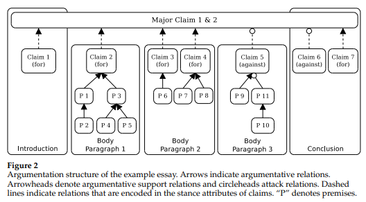
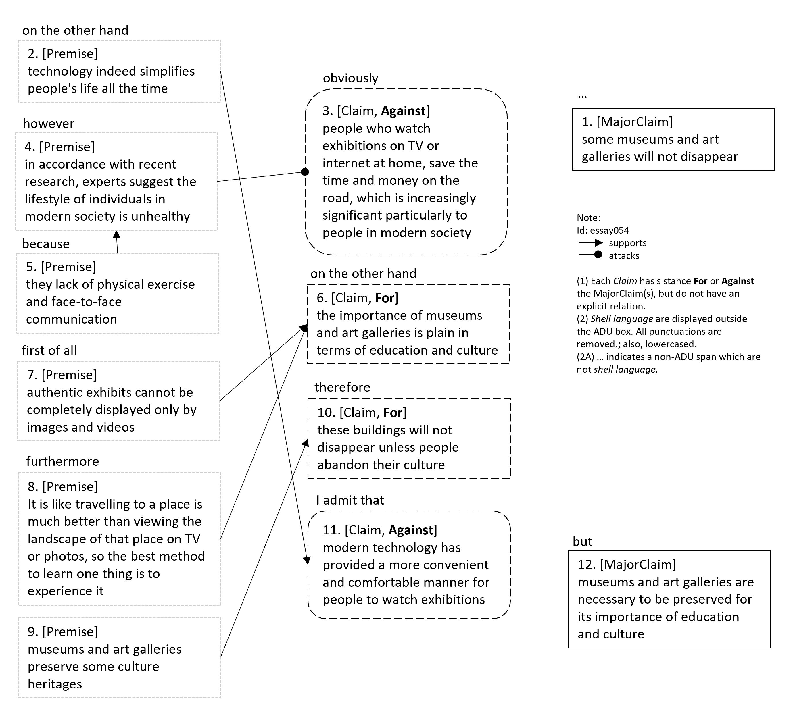

# PIE Dataset Card for "aae2"

This is a [PyTorch-IE](https://github.com/ChristophAlt/pytorch-ie) wrapper for the Argument Annotated Essays v2 (AAE2) dataset ([paper](https://aclanthology.org/J17-3005.pdf) and [homepage](https://tudatalib.ulb.tu-darmstadt.de/handle/tudatalib/2422)). Since the AAE2 dataset is published in the [BRAT standoff format](https://brat.nlplab.org/standoff.html), this dataset builder is based on the [PyTorch-IE brat dataset loading script](https://huggingface.co/datasets/pie/brat).

Therefore, the `aae2` dataset as described here follows the data structure from the [PIE brat dataset card](https://huggingface.co/datasets/pie/brat).

### Usage

```python
from pie_datasets import load_dataset
from pie_datasets.builders.brat import BratDocumentWithMergedSpans
from pie_modules.documents import TextDocumentWithLabeledSpansBinaryRelationsAndLabeledPartitions

# load default version
dataset = load_dataset("pie/aae2")
assert isinstance(dataset["train"][0], BratDocumentWithMergedSpans)

# if required, normalize the document type (see section Document Converters below)
dataset_converted = dataset.to_document_type(TextDocumentWithLabeledSpansBinaryRelationsAndLabeledPartitions)
assert isinstance(dataset_converted["train"][0], TextDocumentWithLabeledSpansBinaryRelationsAndLabeledPartitions)

# get first relation in the first document
doc = dataset_converted["train"][0]
print(doc.binary_relations[0])
# BinaryRelation(head=LabeledSpan(start=716, end=851, label='Premise', score=1.0), tail=LabeledSpan(start=591, end=714, label='Claim', score=1.0), label='supports', score=1.0)
print(doc.binary_relations[0].resolve())
# ('supports', (('Premise', 'What we acquired from team work is not only how to achieve the same goal with others but more importantly, how to get along with others'), ('Claim', 'through cooperation, children can learn about interpersonal skills which are significant in the future life of all students')))
```

### Dataset Summary

Argument Annotated Essays Corpus (AAEC) ([Stab and Gurevych, 2017](https://aclanthology.org/J17-3005.pdf)) contains student essays. A stance for a controversial theme is expressed by a major claim component as well as claim components, and premise components justify or refute the claims. Attack and support labels are defined as relations. The span covers a statement, *which can stand in isolation as a complete sentence*, according to the AAEC annotation guidelines. All components are annotated with minimum boundaries of a clause or sentence excluding so-called "shell" language such as *On the other hand* and *Hence*. (Morio et al., 2022, p. 642)

In the original dataset, there is no premise that links to another premise or claim in a different paragraph. That means, an argumentation tree structure is complete within each paragraph. Therefore, it is possible to train a model on the full documents or just at the paragraph-level which is usually less memory-exhaustive (Eger et al., 2017, p. 16).
However, through our `DOCUMENT_CONVERTERS`, we build links between claims, creating a graph structure throughout an entire essay (see [Document Converters](#document-converters)).

### Supported Tasks and Leaderboards

- **Tasks**: Argumentation Mining, Component Identification, Component Classification, Structure Identification
- **Leaderboard:** [More Information Needed](https://github.com/huggingface/datasets/blob/master/CONTRIBUTING.md#how-to-contribute-to-the-dataset-cards)

### Languages

The language in the dataset is English (persuasive essays).

### Dataset Variants

The `aae2` dataset comes in a single version (`default`) with `BratDocumentWithMergedSpans` as document type. Note, that this in contrast to the base brat dataset, where the document type for the `default` variant is `BratDocument`. The reason is that the AAE2 dataset has already been published with only single-fragment spans. Without any need to merge fragments, the document type `BratDocumentWithMergedSpans` is easier to handle for most of the task modules.

### Data Schema

See [PIE-Brat Data Schema](https://huggingface.co/datasets/pie/brat#data-schema).

### Data Splits

| Statistics                                                   |                      Train |                     Test |
| ------------------------------------------------------------ | -------------------------: | -----------------------: |
| No. of document                                              |                        322 |                       80 |
| Components <br/>- `MajorClaim`<br/>- `Claim`<br/>- `Premise` | <br/>598<br/>1202<br/>3023 | <br/>153<br/>304<br/>809 |
| Relations\*<br/>- `supports`<br/>- `attacks`                 |          <br/>3820<br/>405 |         <br/>1021<br/>92 |

\* included all relations between claims and premises and all claim attributions.

See further statistics in Stab & Gurevych (2017), p. 650, Table A.1.

### Label Descriptions and Statistics

#### Components

| Components   | Count | Percentage |
| ------------ | ----: | ---------: |
| `MajorClaim` |   751 |     12.3 % |
| `Claim`      |  1506 |     24.7 % |
| `Premise`    |  3832 |     62.9 % |

- `MajorClaim` is the root node of the argumentation structure and represents the author’s standpoint on the topic. Essay bodies either support or attack the author’s standpoint expressed in the major claim. The major claim can be mentioned multiple times in a single document.
- `Claim` constitutes the central component of each argument. Each one has at least one premise and takes stance attribute values "for" or "against" with regarding the major claim.
- `Premise` is the reasons of the argument; either linked to claim or another premise.

#### Relations

| Relations           | Count | Percentage |
| ------------------- | ----: | ---------: |
| support: `supports` |  3613 |     94.3 % |
| attack: `attacks`   |   219 |      5.7 % |

- "Each premise `p` has one **outgoing relation** (i.e., there is a relation that has p as source component) and none or several **incoming relations** (i.e., there can be a relation with `p` as target component)."
- "A `Claim` can exhibit several **incoming relations** but no **outgoing relation**." (S&G, 2017, p. 68)
- "The relations from the claims of the arguments to the major claim are dotted since we will not explicitly annotated them. The relation of each argument to the major claim is indicated by a stance attribute of each claim. This attribute can either be for or against as illustrated in figure 1.4." (Stab & Gurevych, *Guidelines for Annotating Argumentation Structures in Persuasive Essays*, 2015, p. 5)

See further description in Stab & Gurevych 2017, p.627 and the [annotation guideline](https://github.com/ArneBinder/pie-datasets/blob/db94035602610cefca2b1678aa2fe4455c96155d/data/datasets/ArgumentAnnotatedEssays-2.0/guideline.pdf).

**Note that** relations between `MajorClaim` and `Claim` were not annotated; however, each claim is annotated with an `Attribute` annotation with value `for` or `against` - which indicates the relation between itself and `MajorClaim`. In addition, when two non-related `Claim` 's appear in one paragraph, there is also no relations to one another. An example of a document is shown here below.

#### Example





### Document Converters

The dataset provides document converters for the following target document types:

- `pie_modules.documents.TextDocumentWithLabeledSpansAndBinaryRelations` with layers:
  - `labeled_spans`: `LabeledSpan` annotations, converted from `BratDocumentWithMergedSpans`'s `spans`
    - labels: `MajorClaim`, `Claim`, `Premise`
  - `binary_relations`: `BinaryRelation` annotations, converted from `BratDocumentWithMergedSpans`'s `relations`
    - there are two conversion methods that convert `Claim` attributes to their relations to `MajorClaim` (also see the label-count changes after this relation conversion [here below](#label-counts-after-document-converter)):
      - `connect_first` (default setting):
        - build a `supports` or `attacks` relation from each `Claim` to the first `MajorClaim` depending on the `Claim`'s attribute (`for` or `against`), and
        - build a `semantically_same` relation between following `MajorClaim` to the first `MajorClaim`
      - `connect_all`
        - build a `supports` or `attacks` relation from each `Claim` to every `MajorClaim`
        - no relations between each `MajorClaim`
    - labels: `supports`, `attacks`, and `semantically_same` if `connect_first`
- `pie_modules.documents.TextDocumentWithLabeledSpansBinaryRelationsAndLabeledPartitions` with layers:
  - `labeled_spans`, as above
  - `binary_relations`, as above
  - `labeled_partitions`, `LabeledSpan` annotations, created from splitting `BratDocumentWithMergedSpans`'s `text` at new lines (`\n`).
    - every partition is labeled as `paragraph`

See [here](https://github.com/ArneBinder/pie-modules/blob/main/src/pie_modules/documents.py) for the document type
definitions.

#### Relation Label Statistics after Document Conversion

When converting from `BratDocumentWithMergedSpan` to `TextDocumentWithLabeledSpansAndBinaryRelations` and `TextDocumentWithLabeledSpansBinaryRelationsAndLabeledPartitions`,
we apply a relation-conversion method (see above) that changes the label counts for the relations, as follows:

1. `connect_first` (default):

| Relations                  | Count | Percentage |
| -------------------------- | ----: | ---------: |
| support: `supports`        |  4841 |     85.1 % |
| attack: `attacks`          |   497 |      8.7 % |
| other: `semantically_same` |   349 |      6.2 % |

2. `connect_all`

| Relations           | Count | Percentage |
| ------------------- | ----: | ---------: |
| support: `supports` |  5958 |     89.3 % |
| attack: `attacks`   |   715 |     10.7 % |

### Collected Statistics after Document Conversion

We use the script `evaluate_documents.py` from [PyTorch-IE-Hydra-Template](https://github.com/ArneBinder/pytorch-ie-hydra-template-1) to generate these statistics.
After checking out that code, the statistics and plots can be generated by the command:

```commandline
python src/evaluate_documents.py dataset=aae2_base metric=METRIC
```

where a `METRIC` is called according to the available metric configs in `config/metric/METRIC` (see [metrics](https://github.com/ArneBinder/pytorch-ie-hydra-template-1/tree/main/configs/metric)).

This also requires to have the following dataset config in `configs/dataset/aae2_base.yaml` of this dataset within the repo directory:

```commandline
_target_: src.utils.execute_pipeline
input:
  _target_: pie_datasets.DatasetDict.load_dataset
  path: pie/aae2
  revision: 1015ee38bd8a36549b344008f7a49af72956a7fe
```

For token based metrics, this uses `bert-base-uncased` from `transformer.AutoTokenizer` (see [AutoTokenizer](https://huggingface.co/docs/transformers/v4.37.1/en/model_doc/auto#transformers.AutoTokenizer), and [bert-based-uncased](https://huggingface.co/bert-base-uncased) to tokenize `text` in `TextDocumentWithLabeledSpansAndBinaryRelations` (see [document type](https://github.com/ArneBinder/pie-modules/blob/main/src/pie_modules/documents.py)).

For relation-label statistics, we collect those from the default relation conversion method, i.e., `connect_first`, resulting in three distinct relation labels.

#### Relation argument (outer) token distance per label

The distance is measured from the first token of the first argumentative unit to the last token of the last unit, a.k.a. outer distance.

We collect the following statistics: number of documents in the split (*no. doc*), no. of relations (*len*), mean of token distance (*mean*), standard deviation of the distance (*std*), minimum outer distance (*min*), and maximum outer distance (*max*).
We also present histograms in the collapsible, showing the distribution of these relation distances (x-axis; and unit-counts in y-axis), accordingly.

<details>
<summary>Command</summary>

```
python src/evaluate_documents.py dataset=aae2_base metric=relation_argument_token_distances
```

</details>

##### train (322 documents)

|                   |  len | max |    mean | min |     std |
| :---------------- | ---: | --: | ------: | --: | ------: |
| ALL               | 9002 | 514 | 102.582 |   9 |   93.76 |
| attacks           |  810 | 442 | 127.622 |  10 | 109.283 |
| semantically_same |  552 | 514 | 301.638 |  25 |  73.756 |
| supports          | 7640 | 493 |  85.545 |   9 |  74.023 |

<details>
  <summary>Histogram (split: train, 322 documents)</summary>


</details>

##### test (80 documents)

|                   |  len | max |    mean | min |    std |
| :---------------- | ---: | --: | ------: | --: | -----: |
| ALL               | 2372 | 442 | 100.711 |  10 | 92.698 |
| attacks           |  184 | 402 | 115.891 |  12 | 98.751 |
| semantically_same |  146 | 442 | 299.671 |  34 | 72.921 |
| supports          | 2042 | 437 |  85.118 |  10 | 75.023 |

<details>
  <summary>Histogram (split: test, 80 documents)</summary>


</details>

#### Span lengths (tokens)

The span length is measured from the first token of the first argumentative unit to the last token of the particular unit.

We collect the following statistics: number of documents in the split (*no. doc*), no. of spans (*len*), mean of number of tokens in a span (*mean*), standard deviation of the number of tokens (*std*), minimum tokens in a span (*min*), and maximum tokens in a span (*max*).
We also present histograms in the collapsible, showing the distribution of these token-numbers (x-axis; and unit-counts in y-axis), accordingly.

<details>
<summary>Command</summary>

```
python src/evaluate_documents.py dataset=aae2_base metric=span_lengths_tokens
```

</details>

| statistics |  train |   test |
| :--------- | -----: | -----: |
| no. doc    |    322 |     80 |
| len        |   4823 |   1266 |
| mean       | 17.157 | 16.317 |
| std        |  8.079 |  7.953 |
| min        |      3 |      3 |
| max        |     75 |     50 |

<details>
  <summary>Histogram (split: train, 332 documents)</summary>


</details>
  <details>
  <summary>Histogram (split: test, 80 documents)</summary>


</details>

#### Token length (tokens)

The token length is measured from the first token of the document to the last one.

We collect the following statistics: number of documents in the split (*no. doc*), mean of document token-length (*mean*), standard deviation of the length (*std*), minimum number of tokens in a document (*min*), and maximum number of tokens in a document (*max*).
We also present histograms in the collapsible, showing the distribution of these token lengths (x-axis; and unit-counts in y-axis), accordingly.

<details>
<summary>Command</summary>

```
python src/evaluate_documents.py dataset=aae2_base metric=count_text_tokens
```

</details>

| statistics |   train |   test |
| :--------- | ------: | -----: |
| no. doc    |     322 |     80 |
| mean       | 377.686 |  378.4 |
| std        |  64.534 | 66.054 |
| min        |     236 |    269 |
| max        |     580 |    532 |

<details>
  <summary>Histogram (split: train, 332 documents)</summary>


</details>
  <details>
  <summary>Histogram (split: test, 80 documents)</summary>


</details>

## Dataset Creation

### Curation Rationale

"The identification of argumentation structures involves several subtasks like separating argumentative from non-argumentative text units (Moens et al. 2007; Florou
et al. 2013), classifying argument components into claims and premises (Mochales-Palau and Moens 2011; Rooney, Wang, and Browne 2012; Stab and Gurevych 2014b),
and identifying argumentative relations (Mochales-Palau and Moens 2009; Peldszus
2014; Stab and Gurevych 2014b). However, an approach that covers all subtasks is still
missing. However, an approach that covers all subtasks is still
missing. Furthermore, most approaches operate locally and do not optimize the global
argumentation structure.

"In addition,
to the lack of end-to-end approaches for parsing argumentation structures, there are
relatively few corpora annotated with argumentation structures at the discourse-level." (p. 621)

"Our primary motivation for this work is to create argument analysis methods
for argumentative writing support systems and to achieve a better understanding
of argumentation structures." (p. 622)

### Source Data

Persuasive essays were collected from [essayforum.com](https://essayforum.com/) (See essay prompts, along with the essay's `id`'s [here](https://github.com/ArneBinder/pie-datasets/blob/db94035602610cefca2b1678aa2fe4455c96155d/data/datasets/ArgumentAnnotatedEssays-2.0/prompts.csv)).

#### Initial Data Collection and Normalization

"We randomly selected 402 English essays with a description of the writing prompt from
essayforum.com. This online forum is an active community that provides correction and
feedback about different texts such as research papers, essays, or poetry. For example,
students post their essays in order to receive feedback about their writing skills while
preparing for standardized language tests. The corpus includes 7,116 sentences with
147,271 tokens." (p. 630)

#### Who are the source language producers?

[More Information Needed](https://github.com/huggingface/datasets/blob/master/CONTRIBUTING.md#how-to-contribute-to-the-dataset-cards)

### Annotations

#### Annotation process

The annotation were done using BRAT Rapid Annotation Tool ([Stenetorp et al., 2012](https://aclanthology.org/E12-2021/)).

All three annotators independently annotated a random subset of 80 essays. The
remaining 322 essays were annotated by the expert annotator.

The authors evaluated the inter-annotator agreement using observed agreement and Fleiss’ κ (Fleiss 1971), on each label on each sub-tasks,
namely, component identification, component classification, and relation identification.
The results were reported in their [paper](https://aclanthology.org/J17-3005.pdf) in Tables 2-4.

#### Who are the annotators?

Three non-native speakers; one of the three being an expert annotator.

### Personal and Sensitive Information

[More Information Needed](https://github.com/huggingface/datasets/blob/master/CONTRIBUTING.md#how-to-contribute-to-the-dataset-cards)

## Considerations for Using the Data

### Social Impact of Dataset

"[Computational Argumentation] have
broad application potential in various areas such as legal decision support (Mochales-Palau and Moens 2009), information retrieval (Carstens and Toni 2015), policy making (Sardianos et al. 2015), and debating technologies (Levy et al. 2014; Rinott et al.
2015)." (p. 619)

### Discussion of Biases

[More Information Needed](https://github.com/huggingface/datasets/blob/master/CONTRIBUTING.md#how-to-contribute-to-the-dataset-cards)

### Other Known Limitations

The relations between claims and major claims are not explicitly annotated.

"The proportion of non-argumentative text amounts to 47,474 tokens (32.2%) and
1,631 sentences (22.9%). The number of sentences with several argument components
is 583, of which 302 include several components with different types (e.g., a claim followed by premise)...
[T]he identification of argument components requires the
separation of argumentative from non-argumentative text units and the recognition of
component boundaries at the token level...The proportion of paragraphs with unlinked
argument components (e.g., unsupported claims without incoming relations) is 421
(23%). Thus, methods that link all argument components in a paragraph are only of
limited use for identifying the argumentation structures in our corpus.

"Most of the arguments are convergent—that is, the depth of the
argument is 1. The number of arguments with serial structure is 236 (20.9%)." (p. 634)

## Additional Information

### Dataset Curators

[More Information Needed](https://github.com/huggingface/datasets/blob/master/CONTRIBUTING.md#how-to-contribute-to-the-dataset-cards)

### Licensing Information

**License**: [License description by TU Darmstadt](https://tudatalib.ulb.tu-darmstadt.de/bitstream/handle/tudatalib/2422/arg_annotated_essays_v2_license.pdf?sequence=2&isAllowed=y)

**Funding**: This work has been supported by the
Volkswagen Foundation as part of the
Lichtenberg-Professorship Program under
grant no. I/82806 and by the German Federal
Ministry of Education and Research (BMBF)
as a part of the Software Campus project
AWS under grant no. 01—S12054.

### Citation Information

```
@article{stab2017parsing,
  title={Parsing argumentation structures in persuasive essays},
  author={Stab, Christian and Gurevych, Iryna},
  journal={Computational Linguistics},
  volume={43},
  number={3},
  pages={619--659},
  year={2017},
  publisher={MIT Press One Rogers Street, Cambridge, MA 02142-1209, USA journals-info~…}
}
```

```
@misc{https://tudatalib.ulb.tu-darmstadt.de/handle/tudatalib/2422,
url = { https://tudatalib.ulb.tu-darmstadt.de/handle/tudatalib/2422 },
author = { Stab, Christian and Gurevych, Iryna },
keywords = { Argument Mining, 409-06 Informationssysteme, Prozess- und Wissensmanagement, 004 },
publisher = { Technical University of Darmstadt },
year = { 2017 },
copyright = { License description },
title = { Argument Annotated Essays (version 2) }
}
```

### Contributions

Thanks to [@ArneBinder](https://github.com/ArneBinder) and [@idalr](https://github.com/idalr) for adding this dataset.
