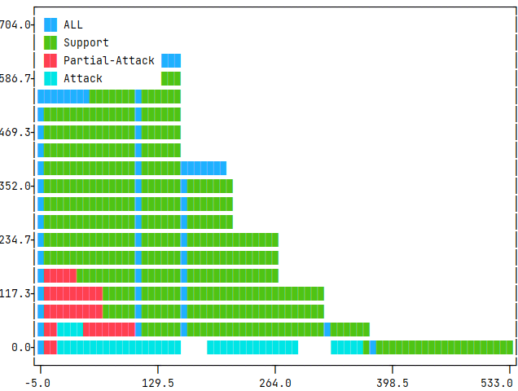
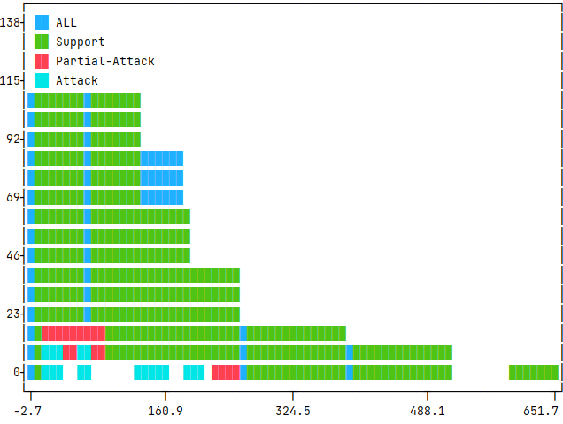
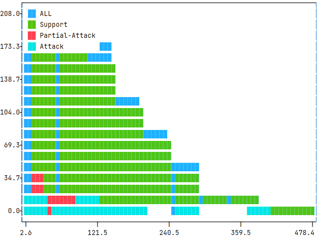
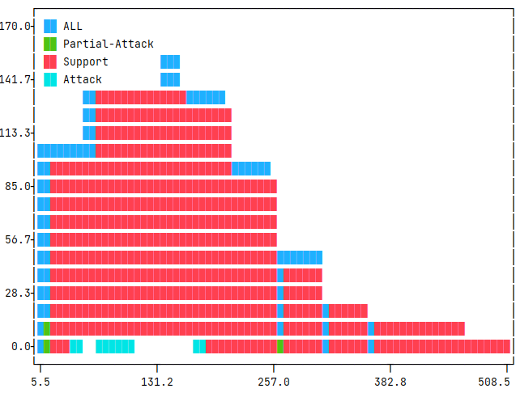
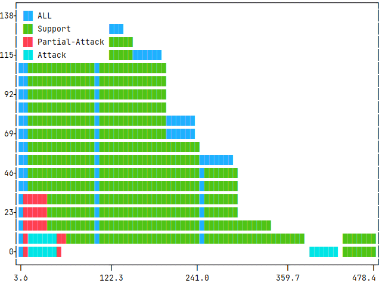

# PIE Dataset Card for "abstrct"

This is a [PyTorch-IE](https://github.com/ChristophAlt/pytorch-ie) wrapper for the AbstRCT dataset ([paper](https://ebooks.iospress.nl/publication/55129) and [data repository](https://gitlab.com/tomaye/abstrct)). Since the AbstRCT dataset is published in the [BRAT standoff format](https://brat.nlplab.org/standoff.html), this dataset builder is based on the [PyTorch-IE brat dataset loading script](https://huggingface.co/datasets/pie/brat).

Therefore, the `abstrct` dataset as described here follows the data structure from the [PIE brat dataset card](https://huggingface.co/datasets/pie/brat).

### Dataset Summary

A novel corpus of healthcare texts (i.e., RCT abstracts on various diseases) from the MEDLINE database, which
are annotated with argumentative components (i.e., `MajorClaim`, `Claim`, and `Premise`) and relations (i.e., `Support`, `Attack`, and `Partial-attack`),
in order to support clinicians' daily tasks in information finding and evidence-based reasoning for decision making.

### Supported Tasks and Leaderboards

- **Tasks**: Argumentation Mining, Component Identification, Boundary Detection, Relation Identification, Link Prediction
- **Leaderboard:** [More Information Needed](https://github.com/huggingface/datasets/blob/master/CONTRIBUTING.md#how-to-contribute-to-the-dataset-cards)

### Languages

The language in the dataset is English (in the medical/healthcare domain).

### Dataset Variants

The `abstrct` dataset comes in a single version (`default`) with `BratDocumentWithMergedSpans` as document type. Note,
that this in contrast to the base `brat` dataset, where the document type for the `default` variant is `BratDocument`.
The reason is that the AbstRCT dataset has already been published with only single-fragment spans.
Without any need to merge fragments, the document type `BratDocumentWithMergedSpans` is easier to handle for most of the task modules.

### Data Schema

See [PIE-Brat Data Schema](https://huggingface.co/datasets/pie/brat#data-schema).

### Usage

```python
from pie_datasets import load_dataset, builders

# load default version
datasets = load_dataset("pie/abstrct")
doc = datasets["neoplasm_train"][0]
assert isinstance(doc, builders.brat.BratDocumentWithMergedSpans)
```

### Document Converters

The dataset provides document converters for the following target document types:

- `pytorch_ie.documents.TextDocumentWithLabeledSpansAndBinaryRelations`
  - `LabeledSpans`, converted from `BratDocumentWithMergedSpans`'s `spans`
    - labels: `MajorClaim`, `Claim`, `Premise`
  - `BinraryRelations`, converted from `BratDocumentWithMergedSpans`'s `relations`
    - labels:  `Support`, `Partial-Attack`, `Attack`

See [here](https://github.com/ChristophAlt/pytorch-ie/blob/main/src/pytorch_ie/documents.py) for the document type
definitions.

### Data Splits

| Diseease-based Split                                      |              `neoplasm` |           `glaucoma` |              `mixed` |
| --------------------------------------------------------- | ----------------------: | -------------------: | -------------------: |
| No.of document <br/>- `_train`<br/>- `_dev`<br/>- `_test` | <br/>350<br/>50<br/>100 | <br/> <br/> <br/>100 | <br/> <br/> <br/>100 |

**Important Note**:

- `mixed_test` contains 20 abstracts on the following diseases: glaucoma, neoplasm, diabetes, hypertension, hepatitis.
- 31 out of 40 abstracts in `mixed_test` overlap with abstracts in `neoplasm_test` and `glaucoma_test`.

### Label Descriptions

In this section, we describe labels according to [Mayer et al. (2020)](https://ebooks.iospress.nl/publication/55129), as well as our label counts on 669 abstracts.

Unfortunately, the number we report does not correspond to what Mayer et al. reported in their paper (see Table 1, p. 2109).
Morio et al. ([2022](https://aclanthology.org/2022.tacl-1.37.pdf); p. 642, Table 1), who utilized this corpus for their AM tasks, also reported another number, claiming there were double annotation errors in the original statistic collection (see [reference](https://github.com/hitachi-nlp/graph_parser/blob/main/examples/multitask_am/README.md#qas)).

#### Components

| Components   | Count | Percentage |
| ------------ | ----: | ---------: |
| `MajorClaim` |   129 |        3 % |
| `Claim`      |  1282 |     30.2 % |
| `Premise`    |  2842 |     66.8 % |

- `MajorClaim` are more general/concluding `claim`'s, which is supported by more specific claims
- `Claim` is a concluding statement made by the author about the outcome of the study. Claims only points to other claims.
- `Premise` (a.k.a. evidence)  is an observation or measurement in the study, which supports or attacks another argument component, usually a `claim`. They are observed facts, and therefore credible without further justifications, as this is the ground truth the argumentation is based on.

(Mayer et al. 2020, p.2110)

#### Relations

| Relations                | Count | Percentage |
| ------------------------ | ----: | ---------: |
| support: `Support`       |  2289 |       87 % |
| attack: `Partial-Attack` |   275 |     10.4 % |
| attack: `Attack`         |    69 |      2.6 % |

- `Support`: All statements or observations justifying the proposition of the target component
- `Partial-Attack`: when the source component is not in full contradiction, but weakening the target component by constraining its proposition. Usually occur between two claims
- `Attack`: A component is attacking another one, if it is
  - i) contradicting the proposition of the target component, or
  - ii) undercutting its implicit assumption of significance constraints
- `Premise` can only be connected to either `Claim` or another `Premise`
- `Claim`'s can only point to other `Claim`'s
- There might be more than one **outgoing** and/or **incoming relation** . In rare case, there is no relation to another component at all.

(Mayer et al. 2020, p.2110)

#### Example


### Collected Statistics after Document Conversion

In this section, we collect further statistics of the dataset after the conversion to `TextDocumentWithLabeledSpansAndBinaryRelations`.
In the commands, we used the following dataset config: `configs/dataset/abstrct_base.yaml`:

```commandline
_target_: src.utils.execute_pipeline
input:
  _target_: pie_datasets.DatasetDict.load_dataset
  path: pie/abstrct
  revision: 277dc703fd78614635e86fe57c636b54931538b2
```

The script `evaluate_documents.py` comes from [PyTorch-IE-Hydra-Template](https://github.com/ArneBinder/pytorch-ie-hydra-template-1).

For the tokenization, we use `bert-base-uncased` from `transformer.AutoTokenizer` (see [AutoTokenizer](https://huggingface.co/docs/transformers/v4.37.1/en/model_doc/auto#transformers.AutoTokenizer), and [bert-based-uncased](https://huggingface.co/bert-base-uncased))
to tokenize `text` in `TextDocumentWithLabeledSpansAndBinaryRelations` (see [document type](https://github.com/ChristophAlt/pytorch-ie/blob/main/src/pytorch_ie/documents.py)).

#### Relation argument (outer) token distance per label

The distance is measured from the first token of the first argumentative unit to the last token of the last unit, a.k.a. outer distance.

We collect the following statistics: number of documents in the split (*no. doc*), no. of relations (*len*), mean of token distance (*mean*), standard deviation of the distance (*std*), minimum outer distance (*min*), and maximum outer distance (*max*).
We also present histograms in the collasible, showing the distribution of these relation distances (x-axis; and unit-counts in y-axis), accordingly.

*Note that*: to collect the relation argument distance by tokens, the [respective branch](https://github.com/ArneBinder/pytorch-ie-hydra-template-1/pull/135) must be checked out instead of the `main` branch.

<details>
<summary>Command</summary>

```
python src/evaluate_documents.py dataset=abstrct_base metric=count_relation_argument_distances
```

</details>

##### neoplasm_train (350 documents)

|                |  len | max |    mean | min |    std |
| :------------- | ---: | --: | ------: | --: | -----: |
| ALL            | 2836 | 511 | 132.903 |  17 | 80.869 |
| Attack         |   72 | 346 |  89.639 |  29 | 75.554 |
| Partial-Attack |  338 | 324 |  59.024 |  17 | 42.773 |
| Support        | 2426 | 511 | 144.481 |  26 | 79.187 |

<details>
  <summary>Histogram (split: neoplasm_train, 350 documents)</summary>



</details>

##### neoplasm_dev (50 documents)

|                | len | max |    mean | min |    std |
| :------------- | --: | --: | ------: | --: | -----: |
| ALL            | 438 | 625 | 146.393 |  24 | 98.788 |
| Attack         |  16 | 200 |  90.375 |  26 | 62.628 |
| Partial-Attack |  50 | 240 |   72.04 |  24 | 47.685 |
| Support        | 372 | 625 | 158.796 |  34 | 99.922 |

<details>
  <summary>Histogram (split: neoplasm_dev, 50 documents)</summary>



</details>

##### neoplasm_test (100 documents)

|                | len | max |    mean | min |    std |
| :------------- | --: | --: | ------: | --: | -----: |
| ALL            | 848 | 459 | 126.731 |  22 | 75.363 |
| Attack         |  32 | 390 | 115.688 |  22 | 97.262 |
| Partial-Attack |  88 | 205 |  56.955 |  24 | 34.534 |
| Support        | 728 | 459 | 135.651 |  33 | 73.365 |

<details>
  <summary>Histogram (split: neoplasm_test, 100 documents)</summary>



</details>

##### glaucoma_test (100 documents)

|                | len | max |    mean | min |    std |
| :------------- | --: | --: | ------: | --: | -----: |
| ALL            | 734 | 488 | 159.166 |  26 | 83.885 |
| Attack         |  14 | 177 |      89 |  47 | 40.171 |
| Partial-Attack |  52 | 259 |      74 |  26 | 51.239 |
| Support        | 668 | 488 | 167.266 |  38 | 82.222 |

<details>
  <summary>Histogram (split: glaucoma_test, 100 documents)</summary>



</details>

##### mixed_test (100 documents)

|                | len | max |    mean | min |     std |
| :------------- | --: | --: | ------: | --: | ------: |
| ALL            | 658 | 459 | 145.067 |  23 |  77.921 |
| Attack         |   6 | 411 |     164 |  34 | 174.736 |
| Partial-Attack |  42 | 259 |  65.762 |  23 |  62.426 |
| Support        | 610 | 459 | 150.341 |  35 |  74.273 |

<details>
  <summary>Histogram (split: mixed_test, 100 documents)</summary>



</details>

#### Span lengths (tokens)

The span length is measured from the first token of the first argumentative unit to the last token of the particular unit.

We collect the following statistics: number of documents in the split (*no. doc*), no. of spans (*len*), mean of number of tokens in a span (*mean*), standard deviation of the number of tokens (*std*), minimum tokens in a span (*min*), and maximum tokens in a span (*max*).
We also present histograms in the collasible, showing the distribution of these token-numbers (x-axis; and unit-counts in y-axis), accordingly.

<details>
<summary>Command</summary>

```
python src/evaluate_documents.py dataset=abstrct_base metric=span_lengths_tokens
```

</details>

| statistics | neoplasm_train | neoplasm_dev | neoplasm_test | glaucoma_test | mixed_test |
| :--------- | -------------: | -----------: | ------------: | ------------: | ---------: |
| no. doc    |            350 |           50 |           100 |           100 |        100 |
| len        |           2267 |          326 |           686 |           594 |        600 |
| mean       |         34.303 |       37.135 |        32.566 |        38.997 |     38.507 |
| std        |         22.425 |       29.941 |        20.264 |        22.604 |     24.036 |
| min        |              5 |            5 |             6 |             6 |          7 |
| max        |            250 |          288 |           182 |           169 |        159 |

<details>
  <summary>Histogram (split: neoplasm_train, 350 documents)</summary>


</details>
  <details>
  <summary>Histogram (split: neoplasm_dev, 50 documents)</summary>


</details>
  <details>
  <summary>Histogram (split: neoplasm_test, 100 documents)</summary>


</details>
  <details>
  <summary>Histogram (split: glucoma_test, 100 documents)</summary>


</details>
  <details>
  <summary>Histogram (split: mixed_test, 100 documents)</summary>


</details>

#### Text length (tokens)

The text (document) length is measured from the first token of the document to the last one.

We collect the following statistics: number of documents in the split (*no. doc*), mean of document token-length (*mean*), standard deviation of the length (*std*), minimum number of tokens in a document (*min*), and maximum number of tokens in a document (*max*).
We also present histograms in the collasible, showing the distribution of these text lengths (x-axis; and unit-counts in y-axis), accordingly.

<details>
<summary>Command</summary>

```
python src/evaluate_documents.py dataset=abstrct_base metric=count_text_tokens
```

</details>

| statistics | neoplasm_train | neoplasm_dev | neoplasm_test | glaucoma_test | mixed_test |
| :--------- | -------------: | -----------: | ------------: | ------------: | ---------: |
| no. doc    |            350 |           50 |           100 |           100 |        100 |
| mean       |        447.291 |       481.66 |        442.79 |        456.78 |     450.29 |
| std        |         91.266 |      116.239 |        89.692 |       115.535 |     87.002 |
| min        |            301 |          329 |           292 |           212 |        268 |
| max        |            843 |          952 |           776 |          1022 |        776 |

<details>
  <summary>Histogram (split: neoplasm_train, 350 documents)</summary>


</details>
  <details>
  <summary>Histogram (split: neoplasm_dev, 50 documents)</summary>


</details>
  <details>
  <summary>Histogram (split: neoplasm_test, 100 documents)</summary>


</details>
  <details>
  <summary>Histogram (split: glucoma_test, 100 documents)</summary>


</details>
  <details>
  <summary>Histogram (split: mixed_test, 100 documents)</summary>


</details>

## Dataset Creation

### Curation Rationale

"\[D\]espite its natural employment in healthcare applications, only few approaches have applied AM methods to this kind
of text, and their contribution is limited to the detection
of argument components, disregarding the more complex phase of
predicting the relations among them. In addition, no huge annotated
dataset for AM is available for the healthcare domain (p. 2108)...to support clinicians in decision making or in (semi)-automatically
filling evidence tables for systematic reviews in evidence-based medicine. (p. 2114)"

### Source Data

[MEDLINE database](https://www.nlm.nih.gov/medline/medline_overview.html)

#### Initial Data Collection and Normalization

Extended from the previous dataset in [Mayer et al. 2018](https://webusers.i3s.unice.fr/~riveill/IADB/publications/2018-COMMA.pdf), 500 medical abstract from randomized controlled trials (RCTs) were retrieved directly from [PubMed](https://www.ncbi.nlm.nih.gov/pubmed/) by searching for titles or abstracts containing the disease name.

(See the definition of RCT in the authors' [guideline](https://gitlab.com/tomaye/abstrct/-/blob/master/AbstRCT_corpus/AnnotationGuidelines.pdf) (Section 1.2) and [US National Library of Medicine](https://www.ncbi.nlm.nih.gov/pmc/articles/PMC6235704/))

#### Who are the source language producers?

\[More Information Needed\]

### Annotations

#### Annotation process

"An expert in the medical domain (a pharmacist) validated the annotation
guidelines before starting the annotation process." (p. 2110)

"Annotation was started after a training phase, where amongst others the component boundaries were topic of discussion. Gold labels
were set after a reconciliation phase, during which the annotators
tried to reach an agreement. While the number of annotators vary for
the two annotation phases (component and relation annotation).

On the annotation of argument components, "IAA among the three annotators has been calculated
on 30 abstracts, resulting in a Fleiss’ kappa of 0.72 for argumentative
components and 0.68 for the more fine-grained distinction between
claims and evidence." (p. 2109)

On the annotation of argumentative relation, "IAA has been calculated on 30 abstracts annotated in parallel by three annotators,
resulting in a Fleiss’ kappa of
0.62. The annotation of the remaining abstracts was carried out by
one of the above mentioned annotators." (p. 2110)

See the [Annotation Guideline](https://gitlab.com/tomaye/abstrct/-/blob/master/AbstRCT_corpus/AnnotationGuidelines.pdf?ref_type=heads) for more information on definitions and annotated samples.

#### Who are the annotators?

Two annotators with background in computational linguistics. No information was given on the third annotator.

### Personal and Sensitive Information

\[More Information Needed\]

## Considerations for Using the Data

### Social Impact of Dataset

"These \[*intelligent*\] systems apply to clinical trials,
clinical guidelines, and electronic health records, and their solutions range from the automated detection of PICO elements
in health records to evidence-based reasoning for decision making. These applications highlight the need of clinicians to be supplied with frameworks able to extract, from the huge
quantity of data available for the different diseases and treatments,
the exact information they necessitate and to present this information in a structured way, easy to be (possibly semi-automatically)
analyzed...Given its aptness to automatically detect in text those
argumentative structures that are at the basis of evidence-based reasoning applications, AM represents a potential valuable contribution
in the healthcare domain." (p. 2108)

"We expect that our work will have a large impact for clinicians as it
is a crucial step towards AI supported clinical deliberation at a large
scale." (p. 2114)

### Discussion of Biases

\[More Information Needed\]

### Other Known Limitations

\[More Information Needed\]

## Additional Information

### Dataset Curators

\[More Information Needed\]

### Licensing Information

- **License**: the AbstRCT dataset is released under a [Creative Commons Attribution-NonCommercial-ShareAlike 4.0 International License](https://creativecommons.org/licenses/by-nc-sa/4.0/legalcode)
- **Funding**: This work is partly funded by the French government labelled PIA
  program under its IDEX UCA JEDI project (ANR-15-IDEX-0001).
  This work has been supported by the French government, through the
  3IA Cote d’Azur Investments in the Future project managed by the
  National Research Agency (ANR) with the reference number ANR19-P3IA-0002

### Citation Information

```
@inproceedings{mayer2020ecai,
  author    = {Tobias Mayer and
               Elena Cabrio and
               Serena Villata},
  title     = {Transformer-Based Argument Mining for Healthcare Applications},
  booktitle = {{ECAI} 2020 - 24th European Conference on Artificial Intelligence},
  series    = {Frontiers in Artificial Intelligence and Applications},
  volume    = {325},
  pages     = {2108--2115},
  publisher = {{IOS} Press},
  year      = {2020},
}
```

### Contributions

Thanks to [@ArneBinder](https://github.com/ArneBinder) and [@idalr](https://github.com/idalr) for adding this dataset.
