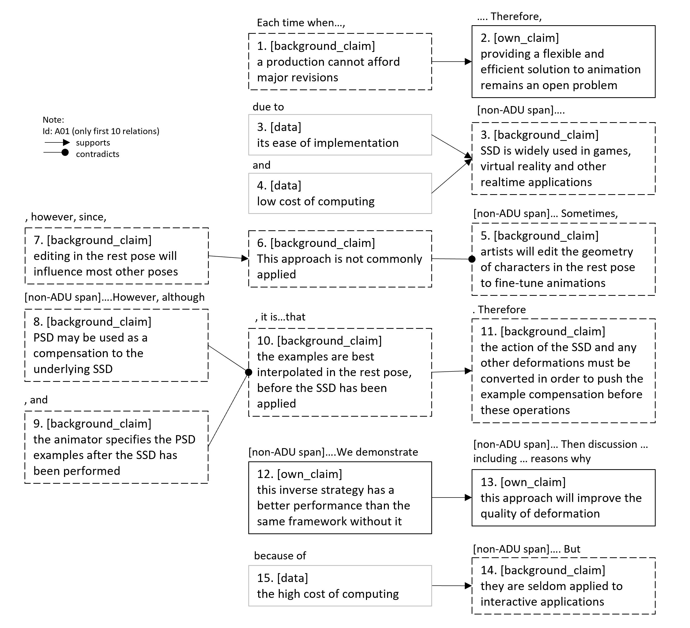

# PIE Dataset Card for "sciarg"

This is a [PyTorch-IE](https://github.com/ChristophAlt/pytorch-ie) wrapper for the SciArg dataset ([paper](https://aclanthology.org/W18-5206/) and [data repository](https://github.com/anlausch/sciarg_resource_analysis)). Since the SciArg dataset is published in the [BRAT standoff format](https://brat.nlplab.org/standoff.html), this dataset builder is based on the [PyTorch-IE brat dataset loading script](https://huggingface.co/datasets/pie/brat).

Therefore, the `sciarg` dataset as described here follows the data structure from the [PIE brat dataset card](https://huggingface.co/datasets/pie/brat).

### Usage

```python
from pie_datasets import load_dataset
from pie_datasets.builders.brat import BratDocumentWithMergedSpans, BratDocument
from pytorch_ie.documents import TextDocumentWithLabeledMultiSpansBinaryRelationsAndLabeledPartitions, TextDocumentWithLabeledSpansBinaryRelationsAndLabeledPartitions

# load default version
dataset = load_dataset("pie/sciarg")
assert isinstance(dataset["train"][0], BratDocumentWithMergedSpans)

# if required, normalize the document type (see section Document Converters below)
dataset_converted = dataset.to_document_type(TextDocumentWithLabeledSpansBinaryRelationsAndLabeledPartitions)
assert isinstance(dataset_converted["train"][0], TextDocumentWithLabeledSpansBinaryRelationsAndLabeledPartitions)

# load version with resolved parts_of_same relations
dataset = load_dataset("pie/sciarg", name='resolve_parts_of_same')
assert isinstance(dataset["train"][0], BratDocument)

# if required, normalize the document type (see section Document Converters below)
dataset_converted = dataset.to_document_type(TextDocumentWithLabeledMultiSpansBinaryRelationsAndLabeledPartitions)
assert isinstance(dataset_converted["train"][0], TextDocumentWithLabeledMultiSpansBinaryRelationsAndLabeledPartitions)

# get first relation in the first document
doc = dataset_converted["train"][0]
print(doc.binary_relations[0])
# BinaryRelation(head=LabeledMultiSpan(slices=((15071, 15076),), label='data', score=1.0), tail=LabeledMultiSpan(slices=((14983, 15062),), label='background_claim', score=1.0), label='supports', score=1.0)
print(doc.binary_relations[0].resolve())
# ('supports', (('data', ('[ 3 ]',)), ('background_claim', ('PSD and improved example-based schemes have been discussed in many publications',))))
```

### Dataset Summary

The SciArg dataset is an extension of the Dr. Inventor corpus (Fisas et al., [2015](https://aclanthology.org/W15-1605.pdf), [2016](https://aclanthology.org/L16-1492.pdf)) with an annotation layer containing
fine-grained argumentative components and relations, believing that argumentation needs to
be studied in combination with other rhetorical aspects. It is the first publicly-available argument-annotated corpus of scientific publications (in English), which allows for joint analyses of argumentation and other
rhetorical dimensions of scientific writing." ([Lauscher et al., 2018](<(https://aclanthology.org/W18-5206/)>), pp. 40-41)

### Supported Tasks and Leaderboards

- **Tasks**: Argumentation Mining, Component Identification, Relation Identification
- **Leaderboard:** [More Information Needed](https://github.com/huggingface/datasets/blob/master/CONTRIBUTING.md#how-to-contribute-to-the-dataset-cards)

### Languages

The language in the dataset is English (scientific academic publications on computer graphics).

### Dataset Variants

The `sciarg` dataset comes in two versions: `default` and `resolve_parts_of_same`.

First, the `default` version with `BratDocumentWithMergedSpans` as document type.
In contrast to the base `brat` dataset, where the document type for the `default` variant is `BratDocument`,
the SciArg dataset was published with spans that are just fragmented by whitespace which seems
to be because of the annotation tool used. In the `sciarg` dataset, we merge these fragments, so that the document type
can be `BratDocumentWithMergedSpans` (this is easier to handle for most of the task modules).
Fragmented spans, which belong to the same argumentative unit, are marked with `parts_of_same` relations.

Second, the `resolve_parts_of_same` version with `BratDocument` as document type.
In this version, all fragmented spans which were separated by other argumentative or non-argumentative spans and
are connected via the `parts_of_same` relations are converted to `LabeledMultiSpans`.

### Data Schema

See [PIE-Brat Data Schema](https://huggingface.co/datasets/pie/brat#data-schema).

### Document Converters

The dataset provides document converters for the following target document types:

- `pytorch_ie.documents.TextDocumentWithLabeledSpansAndBinaryRelations`
  - `LabeledSpans`, converted from `BratDocument`'s `spans`
    - labels: `background_claim`, `own_claim`, `data`
    - if `spans` contain whitespace at the beginning and/or the end, the whitespace are trimmed out.
  - `BinraryRelations`, converted from `BratDocument`'s `relations`
    - labels: `supports`, `contradicts`, `semantically_same`, `parts_of_same`
    - if the `relations` label is `semantically_same` or `parts_of_same`, they are merged if they are the same arguments after sorting.
- `pytorch_ie.documents.TextDocumentWithLabeledSpansBinaryRelationsAndLabeledPartitions`
  - `LabeledSpans`, as above
  - `BinaryRelations`, as above
  - `LabeledPartitions`, partitioned `BratDocument`'s `text`, according to the paragraph, using regex.
    - labels: `title`, `abstract`, `H1`

See [here](https://github.com/ChristophAlt/pytorch-ie/blob/main/src/pytorch_ie/documents.py) for the document type
definitions.

### Data Splits

The dataset consists of a single `train` split that has 40 documents.

For detailed statistics on the corpus, see Lauscher et al. ([2018](<(https://aclanthology.org/W18-5206/)>), p. 43), and the author's [resource analysis](https://github.com/anlausch/sciarg_resource_analysis).

### Label Descriptions and Statistics

In this section, we report our own corpus' statistics; however, there are currently discrepancies in label counts between our report and:

- previous report in [Lauscher et al., 2018](https://aclanthology.org/W18-5206/), p. 43),
- current report above here (labels counted in `BratDocumentWithMergedSpans`'s);

possibly since [Lauscher et al., 2018](https://aclanthology.org/W18-5206/) presents the numbers of the real argumentative components, whereas here discontinuous components are still split (marked with the `parts_of_same` helper relation) and, thus, count per fragment.

#### Components

`default` version:

| Components         | Count | Percentage |
| ------------------ | ----: | ---------: |
| `background_claim` |  3291 |     24.2 % |
| `own_claim`        |  6004 |     44.2 % |
| `data`             |  4297 |     31.6 % |
| total              | 13592 |    100.0 % |

`resolve_parts_of_same` version:

| Components         | Count | Percentage |
| ------------------ | ----: | ---------: |
| `background_claim` |  2752 |     22.4 % |
| `own_claim`        |  5450 |     44.3 % |
| `data`             |  4093 |     33.3 % |
| total              | 12295 |    100.0 % |

- `own_claim` is an argumentative statement that closely relates to the authors’ own work.
- `background_claim` an argumentative statement relating to the background of authors’ work, e.g., about related work or common practices.
- `data` component represents a fact that serves as evidence for or against a claim. Note that references or (factual) examples can also serve as data.
  (Lauscher et al. 2018, p.41; following and simplified [Toulmin, 2003](https://www.cambridge.org/core/books/uses-of-argument/26CF801BC12004587B66778297D5567C))

#### Relations

`default` version:

| Relations                  | Count | Percentage |
| -------------------------- | ----: | ---------: |
| support: `supports`        |  5789 |     74.0 % |
| attack: `contradicts`      |   696 |      8.9 % |
| other: `semantically_same` |    44 |      0.6 % |
| other: `parts_of_same`     |  1298 |     16.6 % |
| total                      |  7827 |    100.0 % |

`resolve_parts_of_same` version:

| Relations                  | Count | Percentage |
| -------------------------- | ----: | ---------: |
| support: `supports`        |  5788 |     88.7 % |
| attack: `contradicts`      |   696 |     10.7 % |
| other: `semantically_same` |    44 |      0.7 % |
| total                      |  6528 |    100.0 % |

##### Argumentative relations

- `supports`:
  - if the assumed veracity of *b* increases with the veracity of *a*
  - "Usually, this relationship exists from data to claim, but in many cases a claim might support another claim. Other combinations are still possible." - (*Annotation Guidelines*, p. 3)
- `contradicts`:
  - if the assumed veracity of *b* decreases with the veracity of *a*
  - It is a **bi-directional**, i.e., symmetric relationship.

##### Non-argumentative relations

- `semantically_same`: between two mentions of effectively the same claim or data component. Can be seen as *argument coreference*, analogous to entity, and *event coreference*. This relation is considered symmetric (i.e., **bidirectional**) and non-argumentative.
  (Lauscher et al. 2018, p.41; following [Dung, 1995](https://www.sciencedirect.com/science/article/pii/000437029400041X?via%3Dihub))
- `parts_of_same` (only in the `default` dataset variant): when a single component is split up in several parts. It is **non-argumentative**, **bidirectional**, but also **intra-component**

(*Annotation Guidelines*, pp. 4-6)

There are currently discrepancies in label counts between

- previous report in [Lauscher et al., 2018](https://aclanthology.org/W18-5206/), p. 43),
- current report above here (labels counted in `BratDocument`'s);

possibly since [Lauscher et al., 2018](https://aclanthology.org/W18-5206/) presents the numbers of the real argumentative components, whereas here discontinuous components are still split (marked with the `parts_of_same` helper relation) and, thus, count per fragment.

#### Examples


Above: Diagram from *Annotation Guildelines* (p.6)

Below: Subset of relations in `A01`



### Collected Statistics after Document Conversion

We use the script `evaluate_documents.py` from [PyTorch-IE-Hydra-Template](https://github.com/ArneBinder/pytorch-ie-hydra-template-1) to generate these statistics.
After checking out that code, the statistics and plots can be generated by the command:

```commandline
python src/evaluate_documents.py dataset=sciarg_base metric=METRIC
```

From `default` version:

- `pie_modules.documents.TextDocumentWithLabeledSpansAndBinaryRelations`
  - `labeled_spans`: `LabeledSpan` annotations, converted from `BratDocumentWithMergedSpans`'s `spans`
    - labels: `background_claim`, `own_claim`, `data`
    - if `spans` contain whitespace at the beginning and/or the end, that whitespace is trimmed out.
  - `binary_relations`: `BinaryRelation` annotations, converted from `BratDocumentWithMergedSpans`'s `relations`
    - labels: `supports`, `contradicts`, `semantically_same`, `parts_of_same`
    - if the `relations` label is `semantically_same` or `parts_of_same` (i.e. it is a symmetric relation), their arguments are sorted by their start and end indices.
- `pie_modules.documents.TextDocumentWithLabeledSpansBinaryRelationsAndLabeledPartitions`
  - `labeled_spans`, as above
  - `binary_relations`, as above
  - `labeled_partitions`, `LabeledSpan` annotations, created from splitting `BratDocumentWithMergedSpans`'s `text` at new paragraph in `xml` format.
    - labels: `title`, `abstract`, `H1`

From `resolve_parts_of_same` version:

- `pie_modules.documents.TextDocumentWithLabeledMultiSpansAndBinaryRelations`:
  - `labeled_multi_spans`: `LabeledMultiSpan` annotations, converted from `BratDocument`'s `spans`
    - labels: as above
    - if spans contain whitespace at the beginning and/or the end, that whitespace is trimmed out.
  - `binary_relations`: `BinaryRelation` annotations, converted from `BratDocument`'s `relations`
    - labels: `supports`, `contradicts`, `semantically_same`
    - in contrast to the `default` version, spans connected with `parts_of_same` relation are stored as one labeled multi-span
    - if the `relations` label is `semantically_same` (i.e. it is a symmetric relation), their arguments are sorted by their start and end indices.
- `pie_modules.documents.TextDocumentWithLabeledMultiSpansBinaryRelationsAndLabeledPartitions`:
  - `labeled_multi_spans`, as above
  - `binary_relations`, as above
  - `labeled_partitions`, `LabeledSpan` annotations, created from splitting `BratDocument`'s `text` at new paragraph in `xml` format.
    - labels: `title`, `abstract`, `H1`

This also requires to have the following dataset config in `configs/dataset/sciarg_base.yaml` of this dataset within the repo directory:

```commandline
_target_: src.utils.execute_pipeline
input:
  _target_: pie_datasets.DatasetDict.load_dataset
  path: pie/sciarg
  revision: 982d5682ba414ee13cf92cb93ec18fc8e78e2b81
```

For token based metrics, this uses `bert-base-uncased` from `transformer.AutoTokenizer` (see [AutoTokenizer](https://huggingface.co/docs/transformers/v4.37.1/en/model_doc/auto#transformers.AutoTokenizer), and [bert-based-uncased](https://huggingface.co/bert-base-uncased) to tokenize `text` in `TextDocumentWithLabeledSpansAndBinaryRelations` (see [document type](https://github.com/ArneBinder/pie-modules/blob/main/src/pie_modules/documents.py)).

#### Relation argument (outer) token distance per label

The distance is measured from the first token of the first argumentative unit to the last token of the last unit, a.k.a. outer distance.

We collect the following statistics: number of documents in the split (*no. doc*), no. of relations (*len*), mean of token distance (*mean*), standard deviation of the distance (*std*), minimum outer distance (*min*), and maximum outer distance (*max*).
We also present histograms in the collapsible, showing the distribution of these relation distances (x-axis; and unit-counts in y-axis), accordingly.

<details>
<summary>Command</summary>

```
python src/evaluate_documents.py dataset=sciarg_base metric=relation_argument_token_distances
```

</details>

|                   |   len |  max |    mean | min |     std |
| :---------------- | ----: | ---: | ------: | --: | ------: |
| ALL               | 15640 | 2864 |  30.524 |   3 |  45.351 |
| contradicts       |  1392 |  238 |  32.565 |   6 |  19.771 |
| parts_of_same     |  2594 |  374 |   28.18 |   3 |  26.845 |
| semantically_same |    84 | 2864 | 206.333 |  11 | 492.268 |
| supports          | 11570 |  407 |  29.527 |   4 |  24.189 |

<details>
  <summary>Histogram (split: train, 40 documents)</summary>


</details>

#### Span lengths (tokens)

The span length is measured from the first token of the first argumentative unit to the last token of the particular unit.

We collect the following statistics: number of documents in the split (*no. doc*), no. of spans (*len*), mean of number of tokens in a span (*mean*), standard deviation of the number of tokens (*std*), minimum tokens in a span (*min*), and maximum tokens in a span (*max*).
We also present histograms in the collapsible, showing the distribution of these token-numbers (x-axis; and unit-counts in y-axis), accordingly.

<details>
<summary>Command</summary>

```
python src/evaluate_documents.py dataset=sciarg_base metric=span_lengths_tokens
```

</details>

| statistics |  train |
| :--------- | -----: |
| no. doc    |     40 |
| len        |  13586 |
| mean       | 11.677 |
| std        |  8.731 |
| min        |      1 |
| max        |    138 |

<details>
  <summary>Histogram (split: train, 40 documents)</summary>


</details>

#### Token length (tokens)

The token length is measured from the first token of the document to the last one.

We collect the following statistics: number of documents in the split (*no. doc*), mean of document token-length (*mean*), standard deviation of the length (*std*), minimum number of tokens in a document (*min*), and maximum number of tokens in a document (*max*).
We also present histograms in the collapsible, showing the distribution of these token lengths (x-axis; and unit-counts in y-axis), accordingly.

<details>
<summary>Command</summary>

```
python src/evaluate_documents.py dataset=sciarg_base metric=count_text_tokens
```

</details>

| statistics |   train |
| :--------- | ------: |
| no. doc    |      40 |
| mean       | 10521.1 |
| std        |  2472.2 |
| min        |    6452 |
| max        |   16421 |

<details>
  <summary>Histogram (split: train, 40 documents)</summary>


</details>

## Dataset Creation

### Curation Rationale

"[C]omputational methods for analyzing scientific writing are becoming paramount...there is no publicly available corpus of scientific publications (in English), annotated with fine-grained argumentative structures. ...[A]rgumentative structure of scientific publications should not be studied in isolation, but rather in relation to other rhetorical aspects, such as the
discourse structure.
(Lauscher et al. 2018, p. 40)

### Source Data

#### Initial Data Collection and Normalization

"[W]e randomly selected a set of 40 documents, available in PDF format, among a bigger collection provided by experts in the domain, who pre-selected a representative sample of articles in Computer Graphics. Articles were classified into four important subjects in this area: Skinning, Motion Capture, Fluid Simulation and Cloth Simulation. We included in the corpus 10 highly representative articles for each subject." (Fisas et al. 2015, p. 44)

"The Corpus includes 10,789 sentences, with an average of 269.7 sentences per document." (p. 45)

#### Who are the source language producers?

It can be implied from the data source that the language producers were academics in computer graphics and related fields, possibly assisted by other human editors.

### Annotations

#### Annotation process

"We trained the four annotators in a calibration phase, consisting of five iterations, in each of which all annotators annotated one publication. After each iteration we computed the inter-annotator agreement (IAA), discussed the disagreements, and, if needed, adjourned the [annotation guidelines](https://data.dws.informatik.uni-mannheim.de/sci-arg/annotation_guidelines.pdf)."

The detailed evolution of IAA over the five calibration iterations is depicted in Lauscher et al. (2018), p. 42, Figure 1.

The annotation were done using BRAT Rapid Annotation Tool ([Stenetorp et al., 2012](https://aclanthology.org/E12-2021/)).

#### Who are the annotators?

"We hired one expert (a researcher in computational linguistics) and three non-expert annotators (humanities and social sciences scholars)." (Lauscher et al. 2018, p. 42)

### Personal and Sensitive Information

[More Information Needed]

## Considerations for Using the Data

### Social Impact of Dataset

"To support learning-based models for automated analysis of scientific publications, potentially leading to better understanding
of the different rhetorical aspects of scientific language (which we dub *scitorics*)." (Lauscher et al. 2018, p. 40)

"The resulting corpus... is, to the best of our knowledge, the first argument-annotated corpus of scientific publications in English, enables (1) computational analysis of argumentation in scientific writing and (2) integrated analysis of argumentation and other rhetorical aspects of scientific text." (Lauscher et al. 2018, p. 44)

### Discussion of Biases

"...not all claims are supported and secondly, claims can be supported by other claims. There are many more supports than contradicts relations."

"While the background claims and own claims are on average of similar length (85 and 87 characters, respectively), they are much longer than data components (average of 25 characters)."

"[A]nnotators identified an average of 141 connected component per publication...This indicates that either authors write very short argumentative chains or that our annotators had difficulties noticing long-range argumentative dependencies."

(Lauscher et al. 2018, p.43)

### Other Known Limitations

"Expectedly, we observe higher agreements with more calibration. The agreement on argumentative relations is 23% lower than on the components, which we think is due to the high ambiguity of argumentation structures."

"Additionally, disagreements in component identification are propagated to relations as well, since the agreement on a relation implies the agreement on annotated components at both ends of the relation."

(Lauscher et al. 2018, p. 43)

## Additional Information

### Dataset Curators

- **Repository:** [https://github.com/anlausch/ArguminSci](https://github.com/anlausch/ArguminSci)

### Licensing Information

[MIT License](https://github.com/anlausch/ArguminSci/blob/master/LICENSE)

This research was partly funded by the German Research Foundation (DFG), grant number EC 477/5-1 (LOC-DB).

### Citation Information

```
@inproceedings{lauscher2018b,
  title = {An argument-annotated corpus of scientific publications},
  booktitle = {Proceedings of the 5th Workshop on Mining Argumentation},
  publisher = {Association for Computational Linguistics},
  author = {Lauscher, Anne and Glava\v{s}, Goran and Ponzetto, Simone Paolo},
  address = {Brussels, Belgium},
  year = {2018},
  pages = {40–46}
}
```

```
@inproceedings{lauscher2018a,
  title = {ArguminSci: A Tool for Analyzing Argumentation and Rhetorical Aspects in Scientific Writing},
  booktitle = {Proceedings of the 5th Workshop on Mining Argumentation},
  publisher = {Association for Computational Linguistics},
  author = {Lauscher, Anne and Glava\v{s}, Goran and Eckert, Kai},
  address = {Brussels, Belgium},
  year = {2018},
  pages = {22–28}
}
```

### Contributions

Thanks to [@ArneBinder](https://github.com/ArneBinder) and [@idalr](https://github.com/idalr) for adding this dataset.
